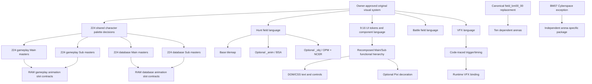

# Championship 2026 — Art Production Master Plan, Phase 1

Status: `TASK D GENERATOR GATES CLOSED / BATTLE PILOT REVIEW CANDIDATE CREATED`

Authority date: 2026-09-01

Registry baseline: 1,248 decision units after ROM reconciliation

Production rule: reproduce the behavior and structural contract, never the ROM pixels

This plan supersedes every 752-unit batching assumption. It does not modify or replace the generated registry, census, reconciliation, or production crosswalk. It records the Task A planning result and provides the dependency input consumed by Task B and Task C.

Update, 2026-09-01: the Owner authorized generator repair and the BM00/BM01 Battle pilot. The generator now emits 1,248 unique production IDs, 224 palette-decision relationships, canonical Battle dependencies, propagated blockers, and corrected A1 membership. Historical defect findings below describe the pre-repair snapshot. The current review candidate is under `docs/art/production/battle/bm00-bm01-pilot/`; no runtime promotion has occurred.

## Master Art Task governance

| Task | Input | Scope | Output | Acceptance criteria | Dependencies | Blockers |
|---|---|---|---|---|---|---|
| A — Art Planner | Four authoritative art files | Verify the registry; classify readiness; establish dependencies, batches, and gates | This master plan | 1,248 units reconcile; no old 752 baseline; no art produced | None | Generated-view defects are reported, never hand-patched |
| B — ROM / Registry Research | Task A plus the four authoritative files | Translate source evidence into production contracts without copying source media | `ART_SOURCE_CONTRACT_REPLACEMENT_CROSSWALK.md` | All nine families covered; evidence and recommendation remain distinct | Task A | Unknown behavior remains unnamed |
| C — Art Architecture | Tasks A and B plus repository renderer and viewport contracts | Define production master/export/QA/promotion contracts and select a pilot | `ART_PRODUCTION_CONTRACTS_PHASE1.md` | Required family contracts complete; pilot has no unresolved behavior blocker | Tasks A and B | Production-ID collision is a Task D entry blocker |
| D — Production Builder | Owner-approved A/B/C output | Create only a bounded original-replacement batch | Original masters, normalized exports, manifests, QA evidence | Technical QA passes; no ROM-derived production media | Owner approval after Phase 1 | Not authorized in this phase |
| E — QA / Reviewer | Task D receipt and files | Independent originality, contract, technical, and runtime review | Review verdict and defects | Builder claims are independently verified | Task D | Not started |
| F — Delivery Report | Tasks A–E | Consolidate provenance, validation, approvals, and promotion state | Final delivery report | Licence, human approval, and runtime QA recorded independently | Task E | Not started |

Task references are sequential: `A -> B -> C -> Owner review -> D -> E -> F`. Phase 1 stops after Task C and repository validation.

## Authoritative inputs

1. `docs/art/ART_ROM_RECONCILIATION.md` — reconciliation reason, corrected baselines, and immutable structural contracts.
2. `docs/art/ART_ASSET_REGISTRY.json` — 1,248 reference decision units.
3. `docs/art/ART_PRODUCTION_CROSSWALK.json` — 1,248 generated production records and current batch assignments.
4. `docs/art/ROM_ART_CENSUS.json` — ROM structural ground truth: 6,317 art payloads in 1,705 families.

The supplied ROM independently hashes to SHA-256 `8ad375ba0bd9b652a25f72dead2b47f78da401e188a8f3e1b7a6f2867ee0c5d1`, matching `DIGIMONCHAMP / YDIJ` in the reconciliation and census. Phase 1 did not extract visual media from it.

## Registry verification

- Registry assets: 1,248; unique `assetId`: 1,248.
- Crosswalk records: 1,248; unique `referenceAssetId`: 1,248.
- Registry-to-crosswalk reference coverage: 1,248; missing: 0; extra: 0.
- Reconciliation: 752 audited + 496 ROM-derived = 1,248.
- Recovered structural evidence: 716 families, 496 decision units, 2,687 ROM files.
- Corrected recovered UI evidence: 118 files in nine directories.
- Crosswalk lifecycle: 0 ready for runtime; 0 shipping ready.

| Family | Units |
|---|---:|
| UI | 449 |
| Character | 448 |
| VFX | 213 |
| Character animation | 60 |
| Cage | 40 |
| Hunt | 17 |
| Battle | 12 |
| 3D | 6 |
| Field unattributed | 3 |
| **Total** | **1,248** |

Every unit remains `ROM_COPYRIGHTED_REFERENCE`, `ORIGINAL_REPLACEMENT_REQUIRED`, `REBUILD`, with no production file, runtime key, human approval, runtime readiness, or shipping readiness recorded in the crosswalk.

## Authoring readiness

The following is a planning classification, not a lifecycle promotion. The registry has no dedicated readiness enum, and all 1,248 production records still require a master, human approval, and runtime QA.

The explicit blocked set is the union, by `referenceAssetId`, of registry trace/unknown-semantic/partial-semantic flags and crosswalk trace flags. It contains 257 units.

| Family | Explicitly trace-blocked | Semantics-neutral ready to author |
|---|---:|---:|
| Character | 0 | 448 |
| UI | 2 | 447 |
| VFX | 187 | 26 |
| Character animation | 60 | 0 |
| Cage | 0 in generated views | 40 with scope restrictions |
| Hunt | 1 | 16 |
| Battle | 2 | 10 |
| 3D | 2 | 4 |
| Field unattributed | 3 | 0 |
| **Total** | **257** | **991** |

The 257 explicit blockers are:

- 187 2D sprite-VFX families: caller, trigger, and timing unknown.
- 60 animation slot contracts: slot semantics unknown.
- three unattributed fields: consumer unknown.
- HM00: biome identity and terrain effects unknown.
- two Gate 3D assets: camera/input call trace incomplete.
- two Battle Main/Sub NXR scene-role records: node semantics partial.
- Battle Island (`field_bm04_01`) and Battle Volcano (`field_bm03_01`): animated-layer placement/timing trace incomplete.

The work brief adds scope-level restrictions that are not fully projected into generated record blockers: Cage terrain shapes, assembly rules, and stat bonuses; and every Gate-node-to-HM-field mapping. Cage art may be researched and visually neutral, but no runtime-semantic Cage package may be invented from appearance.

## Dependency and shared-decision graph

The generated registry currently has `dependencies: []` on all 1,248 records. The following graph is therefore a Phase 1 architecture decision, not a claim that the registry already encodes the edges.

### Shared decisions

- 224 original character palette decisions are shared across 448 gameplay/database character records. Shared palette policy must not alias the complete tier packages.
- `field_bm00_00` is one canonical Battle shared-layer decision consumed by ten arenas; BM07 is the exception.
- UI semantic tokens, typography, edge treatment, and touch states are shared across the 449-unit UI family, while Main/Sub source roles stay traceable.
- Global art direction, provenance schema, naming, colour space, atlas limits, and promotion gates are shared by every family.

### Dependent units

- Character animation depends on approved tier-specific character masters and later code trace.
- Gameplay and database character exports depend on one shared palette-decision record but remain four distinct Main/Sub deliverables per entity.
- Hunt exports depend on the three-layer field contract.
- Ten Battle arenas depend on the canonical shared layer.
- UI art depends on the 9:16 screen architecture, not DS coordinates.
- 187 sprite-VFX runtime bindings depend on code trace.
- Cage runtime art depends on externally authoritative geometry/assembly/stat semantics.

### Independently authorable after Owner approval

- 447 non-blocked UI records, provided they use the 9:16 UI contract.
- 26 clean-room VFX reference families whose role is already bounded.
- 16 non-HM00 Hunt groups, provided no Gate mapping is implied.
- four non-blocked 3D records, subject to the clean-room DCC contract.
- visually neutral Cage exploration only; runtime promotion remains blocked by missing semantics.
- character visual targets only after tier-qualified production IDs are available.

## Generated-view defects to report

These are Task D entry blockers. They must be fixed in the generator and rebuilt; the generated JSON files must not be patched by hand.

1. **Character production-ID collision.** The crosswalk has 1,248 records but only 1,024 unique `productionAssetId` values. All 224 duplicate groups contain the gameplay and database records for one entity, affecting all 448 character records. For example, both `art:character:e000-digitama:rom-reference` and `art:character:e000-digitama:db-reference` map to `production:character:character:e000-digitama`.
2. **Dependency graph absent.** All 1,248 registry `dependencies` arrays are empty despite confirmed palette, layer, tier, and shared-layer edges.
3. **Blocker propagation incomplete.** The registry contains 255 explicit trace/partial records; the crosswalk adds two Battle animated-layer blockers but does not carry the other registry blockers into production records.
4. **A1 pilot drift.** The current character pilot names eight gameplay records but no database partners, and its two Gate 3D units remain trace-blocked.
5. **Legacy plan drift.** `ART_PRODUCTION_BATCH_PLAN.md` still describes a 752-record A0 and sixteen Hunt biomes. It is historical evidence, not the active Phase 1 batching authority.

Current validation scripts do not detect items 1–4.

## Existing production-art audit

At the Phase 1 snapshot, `assets/production/` contains 2,571 files (about 305 MB), but file presence is not a readiness claim.

- `ART_PRODUCTION_INDEX.json` registers three runtime bundles and zero shipping-ready bundles.
- Raising Home `int-rh2` and `vs2-hunt` are temporary presentations and are not human-approved.
- Gate `vs2-r1` is an owner-approved structural baseline, not shipping-ready.
- `internal-character-review/m201-remix-v1` is internal-only, not human-approved, not runtime-eligible, and not shipping-ready.
- `internal-faithful-baseline/v1` accounts for most files. Its family manifests are not runtime-eligible or shipping-ready; the VFX manifest still has a licence-document link pending.
- ROM-faithful enlargements, decoded atlases, converted GLBs, and reference composites are research/technical witnesses. They are not original-replacement masters and cannot be promoted merely because they reside below `assets/production/`.

## Dependency-safe batch order

1. Correct production-ID naming, dependency edges, blocker propagation, and pilot membership in the generators; rebuild and validate the views.
2. Approve the family contracts, global visual target, provenance fields, naming, and technical frame in Task C.
3. Run the approved bounded pilot only.
4. Build the 9:16 UI/HUD system.
5. Produce Cage visual families only within traced or neutral boundaries; keep runtime semantics blocked.
6. Produce the sixteen non-HM00 Hunt groups; keep HM00 and Gate mapping blocked.
7. Produce paired gameplay/database character masters after tier IDs are unique; keep unknown animations on RAW slot IDs.
8. Produce the canonical Battle shared layer, then its ten dependent arenas; produce BM07 separately; wait on the two unresolved animated layers.
9. Produce the 26 clean-room bounded VFX families; wait on all 187 sprite-VFX caller/timing traces.
10. Wait for consumer trace before assigning the three unattributed fields.

## Phase 1 acceptance and stop condition

- Four authoritative files read and reconciled to 1,248.
- Task A master plan complete.
- Task B source-to-contract cross-reference complete.
- Task C production contracts and pilot recommendation complete.
- Generated authoritative files and their generator scripts unchanged.
- No artwork generated, normalized, imported, or promoted.
- Required repository validation recorded in `ART_PHASE1_REPORT.md`.
- Task D remains blocked pending Owner review and correction of generator entry blockers.
