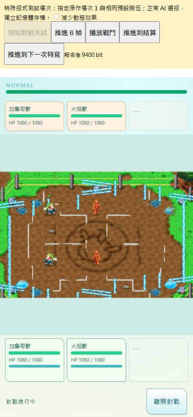
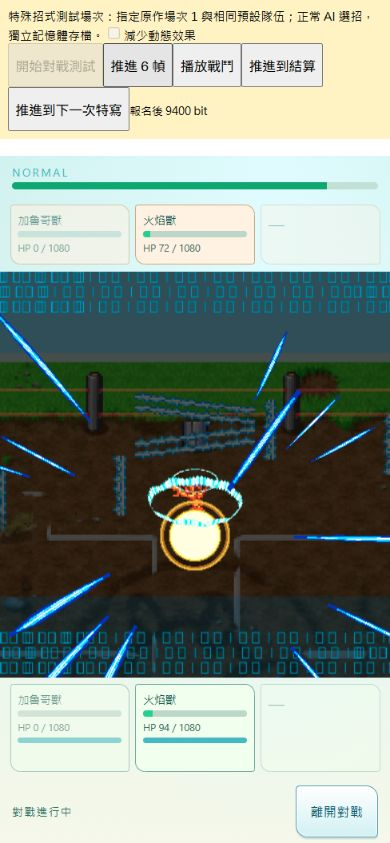
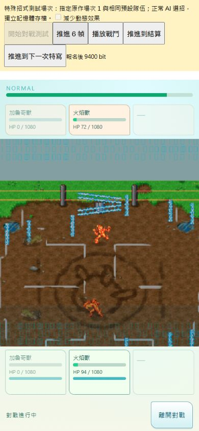

# 對戰特殊招式前導演出 R4

本輪把原作特殊招式的「切換動作、拉近、保持、縮回」接入既有對戰，並綁定既有 Hyper 光環與放射光束資產。**這個前導演出已可驗收；整段攻擊與全部對戰的原作符合度仍為 PARTIAL。**

專案：`championship-2026`；branch `main`；開工及交付檢查 HEAD `d0c48f340baac61cf399bf5bd5922ce58f3d38c7`。保留共享工作樹既有修改，沒有 commit、push、merge 或發布。

## 原作證據與實作

| 項目 | 本輪結果 | 證據界線 |
|---|---|---|
| 特寫腳本 `0x02120900` | Q12 放大、raw 33 動作、等待、還原動作與縮回 | 原始 ARM9 VM 執行；角色位置、邊界與動作完成時間由受控介面提供 |
| 三組 CPU 案例 | 166 幀的縮放、動作、camera operands、tint index、啟用狀態一致 | 不是完整原作對局重播；無從此推論接近或 launch 時機已一致 |
| 特寫期間的交戰 | 暫停普通 dispatch、HP/contact、冷卻及對戰 clock，演出 frame 繼續 | OVL19 `0x0210D478` 特別分支至 `0x0210D5F8` 略過普通更新 |
| 特效 | Hyper core、ring 跟隨同一事件；縮回開始時移除模型，數位幕隨縮放淡出 | `0x0211B03C`、`0x0211B0E8` 的資源與 `0x0211B54C` 的顯示條件；Three 相機仍是手機構圖 |
| 角色綁定 | species 50、81、113；move 99、180、181、255 | 只綁目前已稽核角色的 raw 33；未以語意別名猜測其他角色 |
| 手機構圖 | 原作 1–2 倍倍率套用到同一 Pixi 場地，DOM HUD 保持尺寸 | 聚焦位置是基於既有站位的手機適配，非 DS 世界相機移植 |

原始 CPU 比對：

- [執行腳本](../../../../scripts/research/trace-battle-focus-cpu.py)
- [CPU 資料](../../../../docs/research/BATTLE_FOCUS_CPU_2026-09-07.json)
- [原作影片與 ROM 比較](../../../../docs/research/video-BV13u411B7BK/BATTLE_PRESENTATION_ROM_COMPARISON_2026-09-07.md)

原始 ROM SHA-256：`8ad375ba0bd9b652a25f72dead2b47f78da401e188a8f3e1b7a6f2867ee0c5d1`。

## 修正的實際問題

1. 舊對戰替換 action 時只發出「已釋放」事件，沒有呼叫 pool 的 release。現在會回收原有 claim，避免耗盡 12 個物件後無法再選招。
2. 已完成的 move VM 不再被當成新 invocation 重啟；完成會交回既有釋放流程。未完成且缺少 native object graph 的腳本仍維持原本的部分實作狀態。
3. 原有 Hyper sidecar 的名稱清單錯移一格，省略 `world_root` 並加入額外 mesh wrapper；因此最後的零位元會藏起整個特效。對照原始 MDL0 名稱、GLB 19 個 skin joints 及 16 個 rigid primitives 後，改以原始 node index 控制 primitive 顯示，不再把骨架的 visible 當成蒙皮幾何的可見性。
4. 原有資產預覽會把整組模型縮到固定小框，讓 29 單位的光環被 468 單位的主特效一起縮成小點。對戰改用場地原生像素比例；獨立資產預覽仍保留原有 framing。

[Hyper 節點比對資料](../../../../docs/research/BATTLE_HYPER_VISIBILITY_BINDING_2026-09-07.json) 記錄原始檔與既有 GLB 的 hash、名稱及 primitive 綁定。沒有複製新的 ROM 圖像或 Nitro 二進位進 runtime，也沒有改變 production index 或 shipping gate。

## 驗證

- 全專案 serial regression：**1157 / 1157 通過**。[完整紀錄](../../../../docs/research/battle-focus-full-regression-2026-09-07.tap)
- 最後的生命週期清理與 contract 補充後，focused regression：**51 / 51 通過**。[最後紀錄](../../../../docs/research/battle-focus-final-focused-2026-09-07.tap)
- `git diff --check`：通過。
- **CODEX_BROWSER_PLAYWRIGHT_QA**：390×844、320×740；同時只有既有 Pixi canvas 與 bounded Three overlay，沒有第二個 Pixi bootstrap 或自有 ticker。
- 一般 AI 在指定場次的 clock 991 自然選到 move 255。之後 84 幀保留相同 clock、HP、冷卻，完成後繼續既有招式並結算。沒有強制選招、改傷害或指定勝負。
- 日期、rank 4 與 preset team 是明示的 fixture setup；不代表已驗收從 New Game 遊玩至該場次的進度。
- 390 / 320 無水平溢出；保持段途中換尺寸不重播；縮回時模型退場；結算與特寫途中退出都移除 overlay。
- 減少動態效果：停止鏡頭縮放與數位幕滾動，採用静態特效取樣，保留相同交戰時序。
- 測試場次 entry fee 600：10,000 → 9,400 bit；實際落敗後獎金 0，仍為 9,400 bit。
- QA 初期的 import map、fixture 日期/rank、ring 資產 ID 錯誤均已修正並重新載入驗證；最終畫面未新增 console error。[瀏覽器紀錄](qa/browser-qa.json)

## 畫面

| 普通場地 | 特寫保持 | 縮回 |
|---|---|---|
|  |  |  |

測試頁：`http://127.0.0.1:8738/tests/fixtures/championship-facility-battle-review.html?special`。按「開始對戰測試」後可按「推進到下一次特寫」；它仍逐幀走同一 AI/runtime。「推進 6 幀」觀察演出，「推進到結算」驗證結果。這些控制只存在於 fixture。

## 尚未完成與下一步

- 原作接近敵人的路徑、launch/target 世界座標及 child action object graph 尚未完整移植。
- 本輪取代的是 special prelude；不同招式的飛行物、接觸點、命中特效與傷害時刻，不能因為光束已顯示就宣稱全部完成。
- 數位幕是參考影片的程序繪製，原作 24 條 strip 的精確素材、位置與捲動仍待綁定；tint index 有 CPU 證據，角色 tint palette 尚未接入。
- Three 的原生模型大小保留，但 DS 3D 投影、影片逐像素對拍、不同螢幕刷新率及實體手機效能未驗收。
- 商品化／shipping 資產核准狀態未因本輪改變。

下一個可安全推進的切片是 move 255 的 **launch → projectile/contact → impact**：先補該招式需要的 object graph 和目標位置，再把已存在的 hit/effect native 回呼綁到同一場景。不以未證實的走位或命中公式補空缺。
