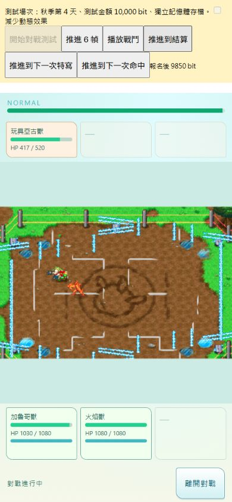

# 正常戰鬥初始化與命中特效 R7

本輪把既有正常 AI 對戰接到角色／目標物件、招式 VM、近身接觸與命中火花。這是一段已能實際完成的正常對戰流程；**完整原作對戰、所有招式及牧場組隊仍為 PARTIAL**。

工作位置：`R:\Projects\Championship2026\championship-2026`，branch `main`，起始 HEAD `d0c48f340baac61cf399bf5bd5922ce58f3d38c7`。起始工作樹已有 618 項變更，保留既有內容，沒有 commit、push、merge 或部署。

## 實際接入

- 正常選招取得招式後，初始化獨立的攻擊者、目標、世界座標與角色資料參照。原本被誤稱為招式的角色 `+5C`，實際是目標；原作 `02111F20` 是目標選擇函式。既有 `committedAction` 保留為目前的流程銜接介面，不宣稱是原作狀態 1 的物件。
- 每場戰鬥共用既有 runtime 內的位元組記憶體，初始化角色 cell bank、原始動作索引／幀時長、HP 與行動資源資料。角色世界座標區塊與 actor `+24` 是兩塊不同記憶體。
- 招式分配主 VM、四個輔助 VM 與 24 個子物件擁有者欄位。前段完成才初始化主攻擊段；輔助命中腳本可以繼續執行。清除只針對對應 VM，保留其他仍在播放的子物件。
- 正常動作投影與碰撞讀取相同的當前動作資料。原有 dispatcher 的通知時機仍為 PARTIAL，但不再出現畫面播放攻擊、碰撞卻讀待機尺寸的分歧。特寫完成時將已驗證的恢復動作進度同步回角色資料。
- 原始近身框接觸通過才沿用現有傷害模組；有參數 actor 的投射物接觸尚未接通，不借用攻擊者的框代替。
- 初始化前沿用已驗證的 `0211C244` 行動資源扣款，一次出招只扣一次。修正顯示層把最大值／目前值顛倒的問題，HP 與資源變化在同一傷害幀通知 DOM。
- 目前招式尚在執行時，既有選招銜接層等待其完成，避免每次冷卻結束就覆寫尚未收招的 VM。這是維持生命週期的銜接處理，不是已完成原作所有接近／發動狀態。
- SDK 定點除法的零分母分支已經用原始 ARM9 指令與受控周邊模擬核對：輸出為零。修正角色重疊時 VM 因此中斷的問題。其他未查證的除法分支沒有順便改寫。

## 命中特效

`0211AF20` 依受擊角色 species 是否達到 `0x48`，選用 `hitspark_small` 或 `hitspark_big`。每種最多 16 個實例，採原始資源的 18 幀動畫長度；原作先檢查完成，再推進下一幀。正常傷害分支產生效果，並由既有戰鬥步進推進；畫面縮放與重繪不增加特效年齡。

使用已登錄的 `assets/production/vfx/licensed-runtime-v1` 資源與原有 bounded Three overlay。沒有增加 Pixi Application、Three overlay、global ticker、router、store 或 save。兩種火花預先載入各 16 個實例，播完後隱藏並重用；離開場景時卸載。減少動態效果時使用靜態取樣，仍保留同一生成與清除條件。

五個家族的資源長度及一般／次級選擇條件均已讀取，但 **次級衝擊與 earth-hit 的正常觸發尚未接入**。本輪 3D 火花位置使用現有手機場地轉換；原作矩陣／深度與命中偏移環形佇列仍未完整移植。

## 正常路徑驗證

測試使用明確指定日期／進度的既有場次與暫代隊伍；沒有強制選招、強制傷害、強制勝負或跳過資源判定。這是正式 battleRuntime 與正式畫面元件的測試入口，不等於已驗收牧場自有角色的完整入口。

| 場次 | 正常 AI 觸發招式 | 結束戰鬥時鐘 | 生成／清除火花 | 未解接點 |
|---|---|---:|---:|---|
| 0 | 179、254、98 | 377 | 13／13 | 沒有 VM error、未知 host call 或缺少 actor graph；部分原始 2D 資源仍不可用 |
| 1 | 179、254、255 | 1083（另含 252 個特寫動畫幀） | 59／59 | 255 的 `0203EA30` 音效 host 尚未接入 |

兩場結算時 active launch 與 active impact 都為零。場次 1 的行動資源實際從 66 降至 54／42，沒有修改最大值或憑空回復。數值是目前明確標記 PARTIAL 的執行流程輸出，不作為原作整場結果一致的證明。

完整數據與程式雜湊：[normal-runtime.json](normal-runtime.json)。重跑：`node scripts/audit-battle-native-lifecycle.mjs`。

瀏覽器正常場次 0（390×844）：

- 第 107 幀由正常 AI 命中，第 113 幀兩個火花位於各自第 6 幀；HP 同步顯示 417／520 與 1030／1080。
- 第 137 幀原先兩個火花已消失，active／visible 都為 0。
- 第 377 幀正常結算，進入結果頁後 canvas 數量為 0。
- 測試錢包 10,000 → 報名後 9,850 → 勝利獎金 7,000 → 16,850；結果第二頁與返回牧場按鈕正常。
- Browser error log 為空。

360×800、390×844、412×915、430×932 的場地與特效 overlay 邊界一致，無橫向溢出。393×852 設定實際回報 clientWidth 394，保留為環境取整紀錄，**不列為精確 393 寬度通過**。寬度檢查在先前同版型命中幀完成，最終 390 寬度截圖已重跑動作／碰撞同步修正。仍未做實體手機 QA。

## 測試

- 原始 CPU 對照：28 組定點除法、512 組 cell 接觸、5 組 VM 子物件清除配置、10 組特效選擇；五種原始 NSBCA 動畫長度與完成邊界。
- 聚焦回歸：48／48（生命週期、動作銜接、顯示資料、特殊前段、VM）。
- 完整 Node 回歸：1186／1186。
- `git diff --check` 通過。既有工作樹的 CRLF／LF 提示沒有改寫其他成果。

原始 CPU 腳本：`scripts/research/trace-battle-lifecycle-cpu.py`；對照輸出：[BATTLE_LIFECYCLE_CPU_2026-09-07.json](../../../research/BATTLE_LIFECYCLE_CPU_2026-09-07.json)。SDK 的周邊除法零分母行為參照 [DeSmuME 官方實作](https://github.com/TASEmulators/desmume/blob/master/desmume/src/MMU.cpp#L1037)，ARM9 後處理本身執行原始指令。這不是實體 DS 硬體錄製。

## 尚未完成

1. 原作目標偏好、完整接近／發動／收招狀態與初始站位。`C144` 的其他全域／狀態拒絕條件亦未全部接回。
2. 所有投射物的 2D 資源池、旋轉接觸、命中偏移、次級／落地特效與音效；現在的兩種火花不代表每招 VFX 完整。
3. `021149A8` 後續受擊資料寫入與落地、異常、復起條件。原本 232 組反應入口證據仍有效，但不能據此稱整段已完成。
4. 牧場自有角色的正式三人組隊、現有養成數值轉入，以及養成／狩獵／捕獲／進化的完整動作觸發。
5. 全角色逐招正常遊玩驗收、實體手機與 shipping 驗收。既有素材／rights／shipping 狀態沒有升級。

下一個可延續的工程接點是 `021149A8` 的反應寫入到落地／復起狀態，沿用本輪的同一角色與目標資料，再處理投射物資源池。現有全招式靜態清單仍維持 `normalGameplayAcceptedRecords: 0`，因為它代表每招完整原作驗收，不能由這兩個正常測試場次取代。
