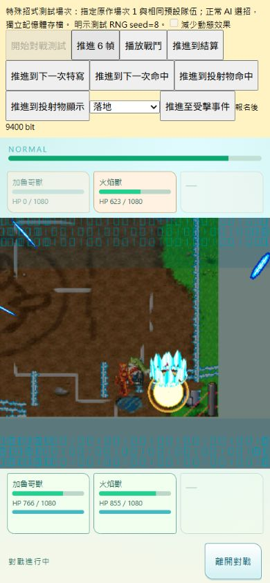
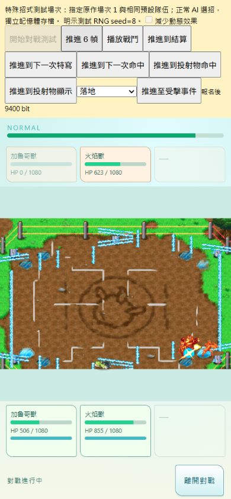
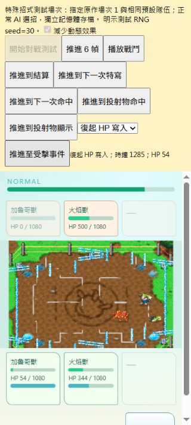

# Battle presentation R13 — complete script/resource binding; original full presentation remains partial

2026-09-08. Product: `R:\Projects\Championship2026\championship-2026`, branch `main`, HEAD `d0c48f340baac61cf399bf5bd5922ce58f3d38c7`. Changes are in the shared working tree; no commit, push or release.

Owner requested completing all remaining move presentation using the supplied original art. This implementation closes the all-move script/resource/host binding work in the local research battle. It does **not** certify every move's original encounter behavior or frame-for-frame presentation. The precise remaining implementation boundaries below must stay visible.

## Implemented

- The existing native VM runs each move's prelude, primary script and four auxiliary scripts with the same actor, target, memory, effect pool and game clock authority. All 595 executable records finish in the controlled source sweep. Record 0 is a dummy; the 30 generic support records use a declared compatible sender in that sweep, while 565 species-specific records use their own species.
- The 151 native 2D banks, 484 sequence bindings and all 1,231 original cells remain the R12 exact-source bundle. No AI-created effect picture is generated or substituted by R13. The 99 source blank cells stay blank.
- Five original 3D impact families are mounted: small/big primary spark, small/big secondary impact and earth hit. Each retains the original 16 slots, source animation duration, copied sprite position, NCER height, signed offset, depth bias and cleanup condition. The existing bounded Three overlay preloads all 80 slots; source GLB and native animation/material/visibility sidecars are reused.
- All 224 character profiles / 228 species mappings now construct native collision/launch geometry from 13,246 NCER cells. Alpha-cropped image bounds had incorrectly replaced NCER bounds; invisible cells in five characters could crash or alter contact. Source pixels, animation IDs, playback modes and ticks are preserved.
- Normal special attacks execute the actual prelude VM, then primary/auxiliary scripts. Original F900/F97C engagement writes the action pointer to owner/target +94, resets the appropriate target state, preserves reaction12, and lasts until C628/FA60 disposal. The D490 exclusive update continues the engaged actors and target reactions while ordinary AI/timers/clock pause. D490 and D694 are alternative branches; the earlier claim that engaged objects receive two updates is corrected.
- Original sound table lookup, launch announcement, hit/block/KO sound IDs and current-sequence stop events reach one scene-owned Web Audio graph. The source bundle contains 27 battle streams plus 27 single-note battle sequence samples. Samples are extracted/decoded, not generated. Sources are preloaded; repeated view publications do not replay them; ending/disposal releases voices and listeners. The original critical-hit flash is projected onto the existing unified phone field; reduced-motion mode suppresses it.
- Explicit owner retirement prevents a surviving impact from adopting a reused action-pool address. Ending or interrupting a launch releases its 2D children; impacts finish or clear at the session boundary.
- Native animator snapshots now directly drive the rendered character frame. Global elapsed frames cannot animate a frozen actor or make a late-mounted sprite diverge from the collision cell. Original damage thresholds select hit pauses4/8/10, blocked hits halve them, KO extends the pause, and the original remaining-team lookup supplies verified slowdown durations. Both global counters decrement before the original modulo8 update gate. The out-of-table three-member caller case stays explicitly diagnosed rather than assigned a guessed duration.

## Verification

| Check | Result and scope |
| --- | --- |
| Controlled native execution | 595 records × accepted hit / blocked result / no contact / interrupt frame12 = 2,380 cases; all normal cases DONE, all interruption cases released, zero missing banks, unresolved host calls, script errors or live effects after cleanup |
| Additional original ARM execution | 20 impact-copy/projection, 10 camera, 16 engagement/release, 2 exclusive/ordinary branches, 24 hit-pause thresholds, 15 timing gates, 3 slowdown lookups = 90 cases; explicit SDK/render/notification boundaries |
| Existing prelude oracle | 166 original yielded frames still match zoom, pose, return and camera operands |
| Original audio files | 54 WAV source/PCM hashes, sample count, rate, channel and loop assertions; deterministic builder check passes |
| Normal AI | Seeds1–24 all reach settlement without injected moves, hits or outcomes after engagement correction; the subsequent final global-timing receipts cover normal match0 and special seeds8/20/30, preserving enemy/player revival and resumed selection |
| Regression | `npm test`: 1,253 passed / 0 failed / 0 skipped; final receipt in `verification.json` |
| Browser390×844 | Normal AI seed8, visible special and primary+secondary impact, no overflow; native2D47/47 and impact47/47 released, audio49/49 released, zero missing cells/sounds/host issues |
| Browser320×712 | Reduced motion, normal seed30, actual HP54/1080 plus raw sequence33 revival, then real-time play and normal step advancement to settlement; native2D53/53 and impact75/75 released, audio78/78 released, no overflow/missing resources |
| Local/public boundary | Original effect/audio URLs accepted only on loopback; foreign Host rejected; public package enumeration excludes both bundles and their index entries |
| Whitespace | `git diff --check` passes; existing unrelated CRLF conversion warnings are not new failures |

Normal test witnesses changed because corrected NCER contact and original engagement alter action/RNG scheduling. The assertions for both revival sides, landing, resumed selection, pursuit, contact rejection and full cleanup were retained: final seeds20/30 witness revival, seed1 witnesses pursuit, seed2 witnesses projectile rejection and all three normal effect banks. Old receipts retain their historical source state.

## What is still incomplete or unknown

1. **Three-member KO slowdown caller context remains unknown**: `0211272C` indexes a three-word stack table using team count minus final-down count. Indices0/1/2 have original CPU outputs and runtime bindings; index3 reads outside that local table and needs the actual original caller context. It emits `0211272C_REMAINING_TEAM_INDEX_REQUIRES_CALLER_TRACE`; no duration is invented. The final KO camera transition is not accepted by this move-presentation receipt.
2. All-move execution is a controlled script/resource test, not 595 naturally selected and visually accepted original encounters. Its target is declared, RNG is the declared lower boundary, and the 30 generic support records use a compatible species81 sender. This does not establish original target choice or applicability for those records.
3. Source NSBMD/NSBCA-derived models and numeric placement are bound; hardware rasterization, full original camera matrix/lighting composition and per-move pixel comparison are not accepted. Phone framing remains the existing explicit viewport adaptation.
4. Original sample PCM is preserved, but browser resampling/master headroom and sequence scheduling are an adaptation. Bit-identical NDS audio mixing/priority, full music behavior and listening acceptance on a physical phone are not claimed.
5. Existing untraced status-state bodies, empty ordinary-move-bucket stale-pointer behavior, original AI profile/pre-constructor RNG history, Home-owned party/additional move sources and non-battle triggers remain separate open gameplay work. This pass does not promote them.
6. Physical Android/iOS acceptance, public rights and shipping remain false. The pre-existing deleted tracked `src/data/championship/catalogs/entities.r1.json` still blocks the previously attempted public Pages build; it was not restored or worked around here.

The completed source/resource binding should be reused. The next battle-specific research starts at the precise three-member KO caller context and ending-camera boundary above, followed by targeted original encounter comparison; it should not repeat the bank census, generate replacement sparks, or reimplement the VM.

## Source and receipts

- Verified ROM SHA-256: `8ad375ba0bd9b652a25f72dead2b47f78da401e188a8f3e1b7a6f2867ee0c5d1`.
- Verified OVL19 SHA-256: `d660e3e0bf243541c356c54dcbd1aec58e8df6c2dfaf4a5854d375a5f2d13715`.
- Private source pack: `R:\Projects\Championship2026\YDIJ_PRIVATE_ROM_ART_PACK`. The product never fetches this archive directly.
- Builder: `scripts/build-battle-presentation-sources.py`; numeric tables: `src/data/championship/battlePresentationProfiles.json`; audio manifest: `assets/production/internal-faithful-baseline/battle-audio-v1/manifest.json`.
- NDS decoder cross-check: [DeSmuME SPU implementation](https://github.com/TASEmulators/desmume/blob/master/desmume/src/SPU.cpp), [ndspy sound-wave documentation](https://ndspy.readthedocs.io/en/v4.0.0/api/soundWave.html). Signed PCM8 and the NDS ADPCM integer decode are preserved without normalization or synthetic replacement.
- Original CPU receipt: `docs/research/BATTLE_PRESENTATION_R13_CPU_2026-09-08.json`; reproducible tracer: `scripts/research/trace-battle-presentation-r13.py`.
- `reports/battle-r13-all-moves.json`, `battle-r13-all-misses.json`, `battle-r13-all-blocks.json`, `battle-r13-all-interruptions.json` contain each controlled result and source hashes.
- `reports/battle-r13-normal-24-final.json`, `battle-r13-normal-timing-final.json`, `battle-r13-player-revival-search.json`, `battle-r13-browser.json`, `battle-r13-full-tests-final.log` hold normal/browser/regression evidence.
- `verification.json` alongside this report records final source hashes and status without upgrading original full-match, rights or shipping acceptance.

