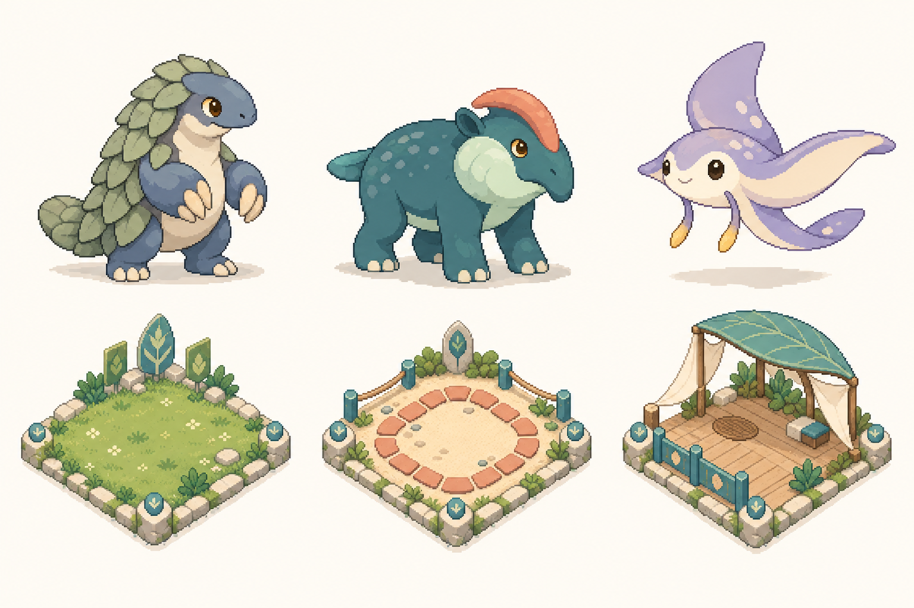

# 原創角色與棲地籠子：第一批製作包

狀態：`ART_PROPOSAL / METADATA_COST_INVENTORY`。執行範圍見[角色籠子優先計畫](../../../planning/ORIGINAL_CHARACTER_CAGE_FIRST_2026-09-15.md)。這是現有生產流程下的工作包，不是第二套資產registry。

## 第一張原創方向板



使用內建 `imagegen`，文字生成一張板，沒有提供原作圖片作輸入。完整[prompt](prompt.txt)與[候選紀錄](concept-manifest.json)一併保存。模型與費用未由工具回傳，不能標成已驗證的GPT Image 2.5 API試產。

上排由左至右為本批候選ID，不是正式角色名稱或原角色一對一映射：

| 候選 | 設計與用途 | 完整動作前需確認 |
|---|---|---|
| OC-P01 | 種莢／穿山甲啟發的小型二足獸，藍灰頭身、鼠尾草色背片、短厚尾 | 背片簡化到原尺寸仍可讀，前肢攻擊接觸點與躺倒姿態 |
| OC-P02 | 河石／貘啟發的低重心四足獸，深青身體、淺色頰、珊瑚拱冠 | 四足步態的前後腿分離、拱冠極端姿態、尾巴是否需簡化 |
| OC-P03 | 漂浮鰩形獸，紫色身體、寬翼、暖色腹面與短觸鬚 | 飛行翅幅、翻面、受擊／倒下、前後遮擋以及清楚的接觸基準 |

下排是空地、運動場與等待區的視覺語彙研究。三張圖的同尺寸菱形構圖不是原作占格規格；正式產出須各自按 definition 0、1、35 的尺寸、地面與物件位置處理。首個正常場景批次還包含definition 15小型保健區，這張板尚未畫它。

主Agent已看圖：六個主體完整、無文字水印、臉與肢體可辨、風格相近。待修：角色背片／斑點較多；籠子草地與邊框細節偏密；前欄及棚架尚未拆層。這不是逐像素精度、15色限制、真正透明底、動作原點、完整53序列或正常遊戲驗收。候選不直接裁成runtime素材。

## 可直接使用的成本與替換表

- [224套角色成本表](character-cost.csv)：動作契約、Main/Sub數量、母版、含空白槽位與空白數。
- [216一般角色的53種原始序列成本統計](action-cost.csv)：每序列的幀數／時間範圍、平均值及序列內非空母版數。平均值不是建議統一幀數；不同序列可能重用同一母版，不能把各列相加當作全角色作畫量。
- [40個籠子visual field替換表](cage-replacement.csv)：正確definition、用途、初始批次、anchor、圖像／地面尺寸、容量與效果。
- [盤點與來源雜湊](inventory.json)：本輪HEAD、實際計數、舊設計進度及資料限制。

一般角色有10,088個exact-RGBA母版；17,027個槽位含53個刻意空白，非空白為16,974。重用統計不能證明原創作畫張數、正常動作觸發或可商用性。

重新讀取目前metadata並重建本批文件表：

```powershell
node docs/art/production/original-character-cage-r1/build-inventory.mjs
```

此工具只寫本資料夾的CSV及inventory.json，不讀ROM／圖片、不改遊戲或原本製作進度。內建檢查224套、216一般角色／8蛋、40／13與2／2序列、texture對應、53種一般角色序列、35商店籠＋等待區＋結構蓋＋3未引用圖。它是文件盤點，不是完整遊戲測試。

## 下一個完整製作批次

角色先完成一隻的全動作樣本，再用四足及漂浮體型檢查方法能否擴展；不等待全部224設定先完成。批次既有研究ID僅作內部相容性映射，公開名稱及具體造型另行原創設計。新板的三隻沒有因此取代既有Owner選案。

籠子先完成35等待區、0空地、1運動場、15小型保健區，四個一起驗實際牧場。每個保留既有模組效果與多格形狀，先替換外觀；本批不加入新家具AI、派遣或線上系統。

只把完整、已審核的包走現有production index與載入流程；本工作包目前 `runtimeEligible:false`、`shippingReady:false`、`humanApproved:false`、`publicReleasePermitted:false`。
