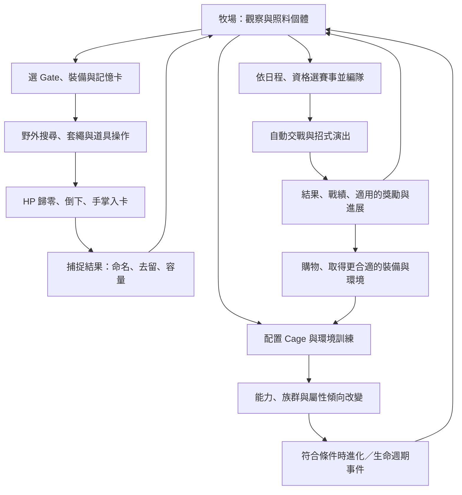

# Digimon Championship：ROM／影片核對與 Godot、Blender 製作規格

核對日期：2026-09-08。交付狀態：**遊戲說明與製作指令完成；Godot 專案與 Blender 資產尚未製作。**

這是一款以多隻數碼獸的生活管理為中心，把環境訓練、野外手勢捕捉、分支進化與戰前編隊連成長期循環的養成模擬遊戲。玩家扮演訓練師／管理者，透過照料、配置、選裝、捕捉與參賽，培育能夠取得更高賽事成績的隊伍。

先把本文件交給製作人與兩邊工程師閱讀，再分別交付 [GODOT_PROMPT.md](GODOT_PROMPT.md) 與 [BLENDER_PROMPT.md](BLENDER_PROMPT.md)。詳細來源及重跑方式在 [EVIDENCE.md](EVIDENCE.md)。這些是供另一個 Godot 實作使用的規格，不是把現有 Web 正式產品切换引擎的變更。

## 1. 本次到底核對了什麼

| 對象 | 本次結果 | 能證明的範圍 |
|---|---|---|
| 正式 Git root | `R:/Projects/Championship2026/championship-2026`；`main`；HEAD `d0c48f340baac61cf399bf5bd5922ce58f3d38c7` | 父資料夾不是 repo；共享工作樹已有大量變更 |
| 原始 ROM | 67,108,864 bytes；header `DIGIMONCHAMP`／`YDIJ`；SHA-256 `8ad375ba0bd9b652a25f72dead2b47f78da401e188a8f3e1b7a6f2867ee0c5d1` | 本次實際讀取、雜湊，與既存研究使用同一日文 ROM |
| 遊戲文字 | 直接由 ROM FAT/FNT 讀取兩個文字 bank；68 筆 help、8 筆教學與存留研究一致 | 原作如何描述規則；不等於完整數值公式 |
| 指定影片 | [数码宝贝---冠军，BV13u411B7BK](https://www.bilibili.com/video/BV13u411B7BK/)，13:17 | 當前頁面與標題畫面已開啟；播放器顯示登入／30 秒試看提示，沒有宣稱本次重新完整播放 |
| 影片存留證據 | 52 張索引圖片全部核對 SHA-256；本次重新目視 7 張主索引＋1 張 09-07 戰鬥補拍 | 8 張關鍵原始影格重新檢視；其餘觀察沿用既存有來源的取樣分析 |
| 時鐘 | 本次直接 ROM 靜態檢查 132／132 通過 | 日曆、07:00 起日、22:00 日結訊號與部分模式時計；不是完整原機時序實測 |
| 戰鬥特效 | 本次重查 2 個命名 loader、5 個資源表項、4 段指令窗口 | 原作效果資產／獨立效果物件的靜態結構；不是逐招影片配對 |

版本差異必須保留：影片為英文版《Digimon World Championship》，ROM 為日文版 YDIJ；功能相似不代表文字索引、平衡、漏洞與函式完全相同。影片反覆可見 HP／TP 9999/9999、Funds 9999999，舊影片分析也記錄作者提及作弊碼。只用它核對可見操作、資訊層級與演出，不用它定正常初始數值、成長速度或勝率。

## 2. 玩家在這款遊戲中做什麼

### 2.1 核心循環

這張圖是製作分析，不表示原作程式有同名節點，也不表示每一场勝利都提升 rank。每個箭頭都要另有條件、資料寫入、取消與失敗處理。

### 2.2 飼育：同時管理多個正在生活的個體

日常場景裡，多隻數碼獸會活動、產生需求、接受環境訓練與出現狀態變化。玩家選中某隻後查看它的資訊，用手掌搬到另一個 Cage；選擇食物後點附近地面，把食物實際放在場內，讓角色靠近並食用。投放食物、食物被吃、能力改變是不同事件。[影片 00:23–00:30](https://www.bilibili.com/video/BV13u411B7BK/?t=23)；ROM tutorial #1500–1501。

食物會剩下，場景有糞便及腐敗物，需要清掃。飢餓、受傷、生病、瀕死與失去個體都屬照料鏈；傷藥和病藥的適用狀態要分開。原作 help #137–142 說明照料不當的後果，但各計時器、機率與數值仍須使用對應 writer 的證據。

手掌還有撫摸、戳碰等互動文字證據（help #143）；不可把它們合併為自創的通用 CARE 加分按鈕。角色性格影響接受指示和 Cage 內活動，而且不因進化／回蛋而改變（help #122）。

### 2.3 Cage：可以組合的功能性環境

Cage 是生活場地與訓練環境。玩家在六角格編輯板放置具有不同形狀的模組，回到牧場後看見相鄰環境組成的連續場景。模組可以影響戰鬥能力、抗性，或影響進化的族群／屬性傾向；也有恢復功能。[影片 02:00](https://www.bilibili.com/video/BV13u411B7BK/?t=120)；help #131–136。

已交叉核對的例子：空地 definition 0／`field_cm01_01` 是 Defense Up、建議 2 隻；跑道 definition 1／`field_cm02_01` 是 HP Up、建議 6 隻。圖像 ID、名稱、效果、商品及資料索引必須一起核對，不能用檔名猜測。

必須分開五種概念：模組 footprint、編輯板可用空間、Cage 建議收容數、全牧場 G 容量、出入野外用的記憶卡 G 容量。help #133 明確允許超过 Cage 建議隻數，但壓力較易增加；不能把它誤作硬性拒絕上限。

較新研究已完成部分幾何與 tile compositor 的原始 ARM 對照，舊報告的「一個 Cage 必占一格／座標全未知」已失效。16 種 shape mask、anchor 對編輯位置的轉換及普通／補洞／牆面 tile 複製各有契約；角色、物件、動畫到完整場景的組合仍要逐項核對。

### 2.4 成長、進化與生命週期

進化會在养成期間發生；[影片 08:36](https://www.bilibili.com/video/BV13u411B7BK/?t=516) 可見進化訊息及外觀改變。原作 help #113–117 區分成長階段，#120 說明族群傾向可影響進化方向，#129 說明戰鬥次數也會影響進化，#128 說明空餘容量不足會阻止進化，#146 說明牌照限制可達世代。

每隻個體有活動期限；進化可延長活動期限。期限耗盡或失去個體後，可能消失，也可能在條件成立時回到數碼蛋；回蛋可以增強基本能力。不能直接改成「所有角色死亡必定回蛋」「永久不會失去」或「點升級按鈕即可任選進化」。這些是 help #123、#130、#142 的文字規則；確切條件、增幅、分支優先順序與重置／保留欄位仍需程式追蹤。

長期決策因此包含：想培育的類型、目前牌照、養成時間、能力與容量，以及下一場值得參加的比賽。

### 2.5 Hunt：用工具在空間中捕捉

玩家先選擇 Gate 地區，檢視當地說明、入口費與資金，再配置裝備和插件。原作文字指出 Gate 種類受 rank 限制，費用不足不能進場；地區與季節影響棲息情況。[影片 00:45](https://www.bilibili.com/video/BV13u411B7BK/?t=45)；help #98、#100–102。

場內拖曳是在瀏覽地圖。工具、目標操作與鏡頭移動必須有明確的輸入優先序，不能一個手勢同時畫繩又移鏡頭。野生角色本身仍會活動並回應工具。

主要成功鏈是：畫線圍住目標 → 放開完成套繩 → 拉扯並管理耐久 → 野外 HP 歸零 → 倒下流程完成 → 手掌工具收取 → 放入記憶卡 → 離場結果處理 → 返家。影片 01:01–01:04 顯示圈線與 Pull；完整成功鏈由 help #104 及較新原作觸控／CPU 重播補證。

較新 YDIJ 追蹤確認的拉繩距離分段如下，數字是原始座標距離，**不是手機螢幕像素**：

| 原始距離 d | 效果 |
|---|---|
| d < 40 | 放鬆，本次 Rope 更新不直接扣 HP；耐久 +10 至上限 |
| 40 ≤ d < 80 | 普通拉扯，累積傷害率並消耗耐久 |
| 80 ≤ d ≤ 160 | 強拉，基礎傷害累積率加倍，另依角色狀態處理事件／耐久 |
| d > 160 | 距離造成斷繩；160 本身不屬這個分支 |

耐久在其他情況耗盡也會斷繩。傷害有 Q12 累積、物種與 Rope 參數，不能把「強拉倍率」寫成每次可見扣血必定剛好兩倍。繩索斷掉可再使用（help #89）；它與有彈數的 Shot 不同。

| 工具家族 | 玩家用途 | 製作時保留的差別 |
|---|---|---|
| Rope，12 種 | 套住、拉扯、耗減目標 HP | 長度、耐久、適用對象；不是放在地面的 Wire |
| Shot，12 種 | 射擊、使角色退縮或產生特定反應 | 彈數、冷卻、彈體／散彈、物種有效性 |
| Wire，6 種 | 地面拉線，阻擋／引導，部分有其他效果 | 合法放置、有效線長、交叉與壽命 |
| 誘引道具，8 種 | 肉餌、移動誘餌、燈 | 食用／移動／夜間引誘是不同流程 |
| 傷害／捕捉陷阱，8 種 | 炸彈、地雷、捕捉陷阱 | 自動或接觸啟動、有限物件池、消耗和清除 |
| 插件，30 種 | Analyzer、Checker、Radar、Memory Checker | 有沒有裝備會改變可見情報；未解鎖的欄位維持未知 |
| 記憶卡，3 種 | 32／64／96 G 的攜帶容量 | 種類／持有狀態、入卡容量判定與結果階段各自處理 |

數量取自 09-08 全道具追蹤／覆蓋清單，並非這支影片全部逐一示範。四種散彈的 response byte 在原作有未初始化來源；現有 Web 版已獲 Owner 核准採普通 Shot 的物種反應初始化。那是 `OWNER_APPROVED_ADAPTATION`，不能偽裝成 ROM 本來就如此。Godot 若要對齊原始版本與現代核准版，必須在研究紀錄中區分兩者。

收取當下的記憶卡與返家名單是不同階段；影片結果頁的紅色 `066G/64G` 不能推翻 YDIJ 入卡容量檢查，也不能用它自行決定所有版本的超額處理。需要追該畫面的資料綁定、版本與作弊影響。捕獲的野外 HP 和永久個體 HP 也不是同一欄：既有 CPU 重播曾確認野外 HP 耗盡後，入卡複製來源個體資料仍為 210／210。

### 2.6 Battle：戰前配置與自動交戰

本片可見流程包括模式、賽事／對手、成員名單、隊伍策略、双方與場地總覽、Battle 開始、自動交戰和結果。每個模式不一定走完所有畫面。[影片 02:42](https://www.bilibili.com/video/BV13u411B7BK/?t=162)。

help #159 直接列出策略方向：Normal Attack 均衡使用、Special Attack 偏必殺技、Support 偏 SP。不可把 Normal Attack 翻成「只普攻」。必殺技和 SP 使用 TP；特殊技可能帶屬性或附加效果。具體機率、選招順序、目標與傷害讀對應 ROM trace。

本片顯示 1VS1 與 3VS3；補充研究另有非對稱隊伍證據，所以資料模型應使用獨立的雙方名額與資格，不能把所有賽事都寫成固定 3v3。這支影片沒有完整展示所有解鎖後的戰中干預手段，不據此宣稱所有模式都絕無干預。

戰場上有移動、接近、出招、受擊與退回等動作，也有角色特寫、場地壓暗、0／1 數位圖樣、光環、放射光束與攻擊軌跡。[約 03:22](https://www.bilibili.com/video/BV13u411B7BK/?t=202) 的 HUD 維持尺寸，場內角色與效果被突出；這不足以單獨決定縮放是 camera、actor 或兩者共同完成。

Godot 必須讓戰鬥規則產生招式、命中、KO、結果等事件，再讓演出消費事件。不能因 Blender 動畫接觸了對手、粒子相撞或播到最後一幀，就自行扣 HP 或決定勝負。若原始 VM 的動畫完成訊號會影響下一狀態，必須以已追蹤的握手契約重現。

### 2.7 日程、商店與長期目標

一季 8 日、4 季一年，沒有週／月；ROM 時鐘常數為一年 32 日。起日 07:00，正常自然時鐘在到達／超過 22:00 後發出日結訊號。help 的「一天大約十分鐘」是概略說明，不能取代模式、更新頻率和暫停規則。

原作 Training 的 divisor 200 與正常 Hunt 的 400 已有不同證據；Godot 的渲染 FPS 不得直接當原作遊戲時間。正常 Hunt 的期限追蹤為 `min(入場時刻 + 8 遊戲小時, 當日 22:00)`；要連同入場條件、收取中的保護與結果轉場重現，不能改成獨立真實八小時。

商店有飼育用品、狩獵道具、Cage 等入口；交易流程是挑商品、看說明與持有、選數量、看總額、确认、扣款入庫。[影片 01:45](https://www.bilibili.com/video/BV13u411B7BK/?t=105)。取消不產生交易，資金及庫存有一致權威。

對戰種類至少須保留原作文字描述的飼育個體間訓練戰、日常可參加的戰鬥、指定日期與資格的稱號賽、Championship 預選與連戰本賽。訓練戰記戰績但不給 fight money（help #153）。預選每年舉辦，必須曾贏過預選才可進本賽（#156）；本賽完整週期與所有解鎖條件不能由這一段說明補成任意常數。

rank／牌照影響可達進化世代、Cage 空間、飼育容量及可參加賽事（#145–148）。原作文字亦有本地連線、Wi-Fi 對戰及 password 角色狀態／對戰功能（#157–158、#162）。本片未完整演示；2026 網路協定、服務、狀態碼相容性與後端都需另定範圍，不因出現 LOGIN 就建立帳號系統，也不能把這些原作功能從總清單中抹掉。

End Day、退出 Hunt、Save & Quit 是三種命令。影片 End Day 附近可見 Saving，這只證明該可見流程，不能推成任意頻率自動存檔。原作完整保存時機、失败與跨日副作用要另追。

## 3. Godot 與 Blender 如何分工

| 工作 | Godot 責任 | Blender 責任 |
|---|---|---|
| 規則與存檔 | 唯一 GameSession、命令、RNG、時鐘、個體／库存／交易、保存 | 不保存玩家 gameplay 狀態 |
| 介面 | Control、Container、CanvasLayer；文字、數字、按鈕、命中區與無障礙 | 可製作底板、圖示素材；不把動態內容烘成貼圖 |
| 飼育／Hunt | Node2D 世界、相機、角色、工具、碰撞／空間查詢、事件 | 模組化環境美術；需要時用 3D 製作後按規格輸出 2D 分層圖 |
| 角色 | 原始 timeline adapter、事件綁定、錨點、raw sequence 選擇 | 依既有核准造型與 motion contract；Blender 不預設取代像素角色管線 |
| Gate／有界 3D | 同一 session 的 Node3D／SubViewport 呈現、選中投影 | 有證據的世界球、標記 anchor、材質、可交換模型 |
| 戰鬥與 VFX | 事件時序、位置、目標、池與 cleanup | 效果幾何、光環、軌跡、貼圖、明確的動畫片段 |

建議技術形態為 **以 2D 為主、局部 3D 的遊戲**。Blender 可以是 2D 素材的製作工具，使用它不要求把所有場景與角色改成自由旋轉的全 3D。原作 Gate 使用的有證據資源是 `gate_select/3D_worldMap_model`；不能因另一個 `earth` 或 `Desktop_Launcher` 檔案存在就把它變成新功能。

Godot 工程採 GDScript、Compatibility renderer 與單執行緒 Web export 作為首個可驗證基準；這是工程建議，不是 ROM 規則。Godot 官方文件目前記錄 Web 需要 WebAssembly／WebGL 2.0，Godot 4 C# 無法匯出 Web，Forward+／Mobile renderer 不適用該匯出。[官方 Web 匯出說明](https://docs.godotengine.org/en/stable/tutorials/export/exporting_for_web.html)。鎖定實際安裝版本後再驗證，不能假定未來版本或手機效能。

Blender 保留 `.blend` 可編輯母檔，交換用 `.glb` 或明確圖層的 PNG。Godot 官方推薦 glTF 2.0；直接匯入 `.blend` 會依賴本機 Blender 做轉換，因此交付 `.glb` 可減少建置機器的外部依賴。[官方格式說明](https://docs.godotengine.org/en/stable/tutorials/assets_pipeline/importing_3d_scenes/available_formats.html)。

## 4. 9:16 觸控畫面的具體要求

原作的上畫面常顯示季節／日期／模式／時間、選中個體或商品資料、概要及訊息；下畫面承擔實際世界操作或選單。不能把它一概寫成上方世界、下方按鈕，也不能把兩張 DS 截圖合成背景就算完成。

建議手機畫面由上到下：窄的共同狀態列、必要的對象／隊伍資訊、主要世界視窗、情境工具列；確認框及內頁由同一 UI 路由管理。這是待實測的配置建議，不是固定百分比，也不新增功能入口。工具列兩組子選單應保留已見內容：

- 管理組：Tamer、Schedule、Cage Edit、Digimon、End Day。
- 功能組：Help、Database、Battle、Save & Quit、Hunt、Shop。

Digimon 個體管理與 Database 物種圖鑑各自有意義；相同 toolbar 位置會因 Training／Hunt 改變用途。Cage Edit 有自己的操作列，不硬套全部共用工具。

畫面只顯示世界的一部分。先把觸控由螢幕轉到 viewport，再轉 native/world space，才執行捕捉、放置與碰撞。改為 9:16 後不改物件間的原始距離、不把整張 Hunt 地圖壓進螢幕、不以螢幕尺寸生成遊戲世界。

## 5. 建議製作順序與實際交付

| 切片 | 最小可玩流程 | Godot 交付 | Blender／美術交付 | 驗收 |
|---|---|---|---|---|
| A | Title／Continue → 牧場 → 選中／搬動 → 保存 → 重開恢复 | 一個 session、路由、個體 ID、存檔、輸入座標 | 一組核准角色素材、有限 Cage 圖層或研究占位 | 選取／搬動不串錯個體，重開一致 |
| B | 食物投放 → 角色靠近／食用 → 清掃；Cage 配置 | 原始條件有據的照料 reducer、食物實例與板上放置 | 食物／殘留／清掃素材、可拼接環境 | 取消與無效點擊不誤扣，世界動作與數值事件一致；未知 writer 使相應子項保留部分完成 |
| C | Gate → Loadout → 單場單工具捕捉 → 結果 → 返家保存 | 完整 Rope／HP0／倒下／手掌／容量／去重流程 | 場地分層、圈線／繩索／倒下／收取呈現 | 正常 pointer 操作成功，超容拒絕、斷繩、重複提交和讀檔可檢查 |
| D | 全工具／插件、日程、Shop → 正常消耗與回存 | 全 ID 清單、有效性、費用、時計 | 各工具圖形、必要音效與清除時序 | 逐項成功／無效／空量／取消，不用一次演出代表全家族 |
| E | 合資格賽事 → 編隊策略 → 自動戰鬥 → 結果 | 已追的 AI／算式／腳本、獎勵交易、日期與隊伍 | 一個戰場、招式分層與受擊／結果表現 | 邏輯 replay 和可見事件皆一致，失敗／離場不重複付款 |
| F | 跨日、成長、進化、牌照到 Championship | 完整條件與優先序、生命週期及長期保存 | 進化前後造型、日結／進化演出 | 多日正常流程與原作對照；沒有證據的門檻不填預設數值 |

本順序是工程計畫，不宣稱尚未知的分支已能閉合。後續切片的研究可先進行；前一切片的正式完成要有端到端證據。

## 6. 完成、部分完成、未知與下一步

**本次完成**：來源核對、遊戲定位、主要流程、Godot／Blender 分工、可複製的兩份指令、驗收矩陣與本次驗證紀錄。

**原作證據部分完成**：主要可見流程与文字規則相當完整；Rope、時間、Cage 幾何、戰鬥腳本／演出有較新 bounded trace，必須保留各自的驗證範圍。現有 Web 版的測試通過與原作全遊戲等價分開。

**未知或仍待閉合**：完整養成數值 writer、全進化圖與優先序、日結全部副作用、所有賽事／牌照門檻、部分 HUD 綁定、原作與英文版差異、全部動畫語意與每招正常視聽驗收、通信／password 完整契約。

**本次限制**：線上播放器的試看／登入提示限制了新的完整觀看；沒有重跑模擬器全程，沒有實體手機 QA。這沒有阻止以既存原始影格及本機 ROM 完成本次規格，但不能把它報成新的完整實玩驗證。

**下一個安全步驟**：指定 Godot 專案後，由 Godot 工作者依指令先清點可攜的已驗證 domain 與素材契約、建立切片 A；Blender 工作者交付同一切片所需的少量素材及匯入驗證。現有 Web 產品仍沿用 DOM／單一 Pixi 與存檔權威。所有 ROM／decoded／影片影格維持研究用途；新的 Godot 發布素材需原創或獲授權並有相應登錄。
