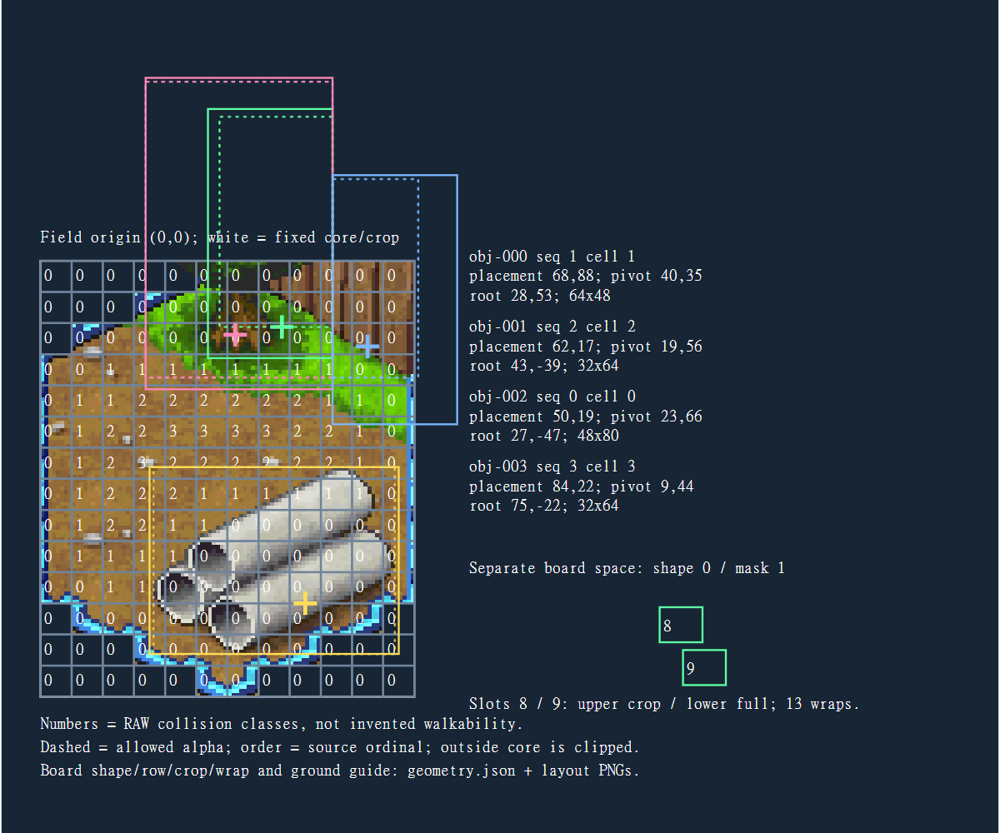
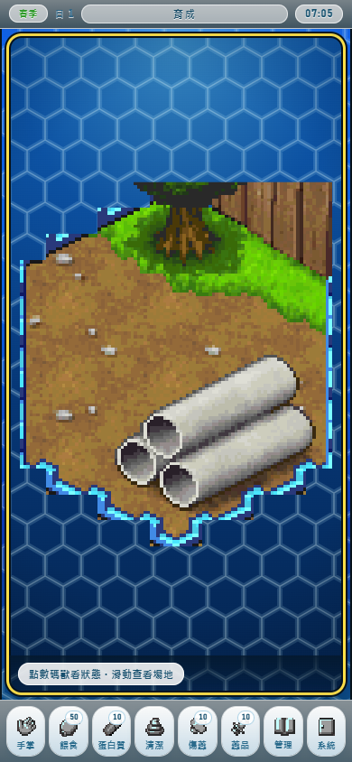
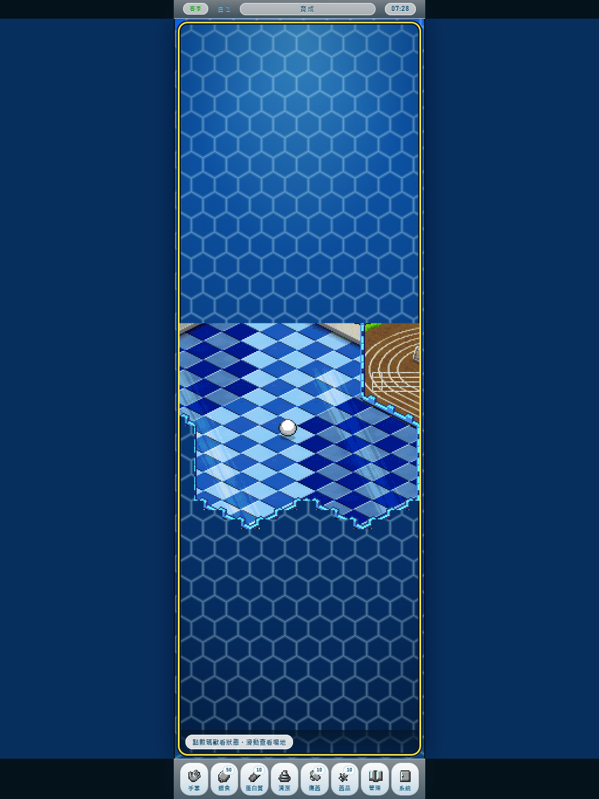

# 2026-09-16 Convergence 收束報告

本輪完成 **field_cm01_01 契約／模板／重建 proof**，以及 **同一套 UI/runtime 的三尺寸量測與縮放驗收**。沒有新增遊戲、美術批次或 production 資產升版。這是 Handoff 的唯一交付報告；舊 `repo-consolidation-2026-09-16` 回條保留其原批次快照，不是另一份本輪 roadmap。

## CURRENT TRUTH

**CONFIRMED — Git 與本地工作已收束。**

- 起始正式 repo：`R:/Projects/Championship2026/championship-2026`，branch `main`，HEAD／origin main `3e212c2e1b80306e51f2b2593484a28442dca4d3`。原 working tree 當時有 9 個 tracked 修改與 4 個 untracked 項目。
- 已執行 `git status --short`、`git branch --show-current`、`git remote -v`、`git fetch --all --prune`。遠端為 `https://github.com/Orochi771127/championship-2026.git`。
- 從 `origin/planning/nexus-link-product-scope-2026-09-16` 的 `20c9b5692cc0048bb234e2fe4c62fe9ad00d263c` 建立同 repo worktree：`R:/Projects/Championship2026/championship-2026-convergence-20260916`。沒有 reset、stash、drop、clean 或覆蓋原未提交工作。
- 工作期間，原 main 的玻璃介面、各畫面配色、最近整合測試、概念圖與前輪回條已提交並同步到 `d7a7dcfd8f7cda41976f12329d99f50a77882371`。已在隔離 planning 分支納入這批提交；唯一衝突 `tests/README.md` 保留雙方命令。原 main 乾淨，沒有由本輪修改。
- proof 起始提交 `d9fc798`，同步主線到 planning 的提交 `82aad00`；本報告的 runtime baseline 為 `d7a7dcf`。PR #2 保持 Draft / open；本輪只推送 PR 的 head branch，不合併進 main。
- 完整讀完 Handoff、AGENTS、docs index、三份 canonical planning、六份 Sep16 planning，再查四個指定 Cage source、faithful-hd40、production manifest 與既有測試。Nexus Link 由本 repo 原地演進；不匯入另一個 Nexus repo 的 save、router、素材或產品規則。

**CONFIRMED — Cage runtime 已有正確的組裝與幾何基礎。**

`ranchSlotGeometry.js` 保存 16 個 shape masks 與 36 個 definition-shape bindings；`nativeRanchLayout.js` 保存原生新存檔的起始定義 `[35,0,1,15]`、slot `[0,8,4,7]`。舊存檔仍有相容的 shelf layout 路徑。40 個 field 是視覺資產數量，不是 40 個可買 CageDefinitions。

`ranchTileComposition.js`、`raisingCageArtPlan.js` 與既有 ground runtime 分別處理 tiles／raw planes、上排裁切／水平回捲及可遊玩地面。Board、occupancy、destination tiles、object local pixels 是四種座標，不可互換。原作幾何依據見 [native geometry contract](../../contracts/championship/CHAMPIONSHIP_RANCH_NATIVE_GEOMETRY.v1.json)。

目前 `runtimeMapArtBundle.js` 載入已合成的 field frame，再投影現有 placements；沒有把四個 object cells 再疊一次。faithful reference 為 `runtimeEligible:false`；既有 licensed runtime 為 `runtimeEligible:true / shippingReady:false`。本 proof 不改這些權利與升版狀態。

| 物件 | Sequence → Cell | placement | pivot | 計算結果 placement − pivot |
|---|---|---|---|---|
| obj-000 | 1 → 1 | 68,88 | 40,35 | 28,53 |
| obj-001 | 2 → 2 | 62,17 | 19,56 | 43,-39 |
| obj-002 | 0 → 0 | 50,19 | 23,66 | 27,-47 |
| obj-003 | 3 → 3 | 84,22 | 9,44 | 75,-22 |

負的 Y 是原有物件超出 96×112 field 的部分；沿用原裁切，不能靠人工推回畫布。native、static、4x runtime、上排、下排、回捲接縫與起始籠舍 **7 組比較全部 0 changed pixels**。重建 PNG 的 SHA-256 與 production frame 一致：`816EC7851457DF8DF012A71CF36CEBC69DBDAF62E42B2C091D746733FA1DBB0A`。

**CORRECTED — 規劃已修正。**

1. 「需要新 compositor／預設 Sharp」改為沿用已存在 Python/Pillow raster library，僅增加 decoded-cell export 入口。
2. 「目前 runtime 會再疊 objects」改為正確的 flattened-field 載入說明；full PNG 是合法 build output，不能當唯一 authoring master。
3. 模組 footprint UNKNOWN、14→20 slots pending 的舊表格，改成現有 masks、rank table、native replay 與新舊 Save 路徑。
4. 本輪只做 Cage proof → Responsive foundation → Creature readiness。移除 index 中第三個 production pilot 的重複施工清單；未來 Blender／Creature／ComfyUI production pilots 明確 DEFERRED。
5. shared bottom anchor／normalization 限新原創 AnimationProfile；native 替換保留每格 source origin、offset、timing、flip、blank 與適用 scale。沒有為 generic skill 改動正確 runtime。
6. 舊 R0–R8、Gate Select POC 是各自日期的規劃快照；本輪入口與下一步集中於 Handoff／本報告。500+ 容量與新 Habitat AI 只保留未驗證的未來設計。

**CONFIRMED / DEFERRED — Responsive foundation。**

同一頁經 New Game、原有 page-hidden autosave、Continue，再做 standalone Cage preview 與 normal starting ranch；每個模式走三尺寸再回 390，共 8 組。每組保留同一 DOM root／canvas，8 個 toolbar controls 可達，無 document overflow，host 與 canvas 對齊；單次 resize journey 的保存 bytes/hash 不變。這不把持續運行的遊戲時間誤判成 layout-induced state drift。

| 視窗 | Profile（量測分類） | 實測 field host 寬度 | 狀態 |
|---|---|---:|---|
| 390×844 | COMPACT <600 | 370px | 瀏覽器相容 PASS |
| 820×1180 | MEDIUM 600–839 | 410px | 瀏覽器相容 PASS；資訊重排 DEFERRED |
| 1024×1366 | EXPANDED ≥840 | 410px | 瀏覽器相容 PASS；資訊重排 DEFERRED |

實際大螢幕仍為中央窄場景，左右餘裕未使用。沒有新增 persistent inspector、nav rail、tablet-only screen、第二份 gameplay state 或角色 variants。profile 是本輪 QA 分類，未宣稱已有新的 runtime layout token 系統。

**Creature pipeline readiness：部分就緒，生成數量 0。**

- CONFIRMED：repo 有 `build-character-appearance-workflow.py`、`compile-pixel-character-bank.py`、角色 replacement contract、registry、Main/Sub 預檢、alpha／裁切／boundsOverride／preview／receipt 與 promotion gates。既有生成清單含 224 entities、17,235 slots、11,480 sequences、10,184 unique nonblank masters，標記 RESEARCH_ONLY；本輪讀取核對，沒有重跑來源解碼或批量生產。
- CONFIRMED：已安裝的 `sprite-pipeline` 有 edit canvas、whole strip 與 preview helpers；其 local note 明確禁止把 shared-anchor normalization 直接套進 Championship native 替換。
- DEFERRED：未來一隻 Idle/Move/Attack/Hit/Eat/Sleep 的 approved identity、完整可用動作集、真透明與實際場景可讀性／成本 acceptance。單一漂亮概念圖不代表六動作 ready。
- 這次同步進來的四張概念圖是 main 原有提交；manifest 為 `ART_PROPOSAL_REFERENCE_BACKED`、`resolvedModel:UNKNOWN_TOOL_NOT_EXPOSED`、`hardAlphaReady:false`。本輪未生成、未核准、未將其加入 runtime。

**UNKNOWN_REQUIRES_TRACE。**

前景遮擋／actor-object ordering、新的 authored connector 語意、任意新角色的姿態接觸點及尚未驗證原作行為仍保持未知。此靜態 proof 不保證任意新圖都美術正確；更換圖必須保留已驗證 canvas／pivot／安全 alpha bounds，幾何變更需版本化契約及審查。baked duplicates、腳底接觸、半透明邊緣仍須看圖與場景驗收。未完成 physical-device、Steam／商業權利或 shipping acceptance。

## REUSED

- 原有 app、router、canonical save key、DOM components、Pixi stage/ticker、Raising/Cage/Ground simulation、production loader 與 `cageArt` debug preview。
- `scripts/lib/ydij_map_formats.py` 的座標語意、Pillow、`build-cage-faithful-hd40.py` 的已解碼輸出、既有 promotion 工具；不重新讀 ROM、不批量重建 40 fields。
- Playwright 1.62.1、Chrome、`championship-browser-opening.cjs`、`browser-qa-output.cjs`、Home 與 recent integration browser gates、CI scope inventory。
- skills：`championship-art-production`、`game-ui-ux`、engineering 的 review/debug/testing/documentation、`skill-installer`、`plugin-management`、`sprite-pipeline`。原有 skills／helpers 已存在，沒有重複安裝。
- 外掛：GitHub 讀 PR／分支並更新 Draft，Championship Evidence MCP 查來源索引。Playwright MCP 的新 tab 呼叫 timeout；正式畫面證據由 repo 已鎖定的 Playwright CLI 成功取得。沒有把 unavailable tool 當作驗證完成。

外部工具於 2026-09-16 核對 upstream、license metadata、是否 archived 與推送時間；完整回條見 [upstream-audit.json](upstream-audit.json)。未複製第三方 code/workflow。全部 repo 當時皆 `archived:false`；推送日期不是相容性測試。

| Upstream | License / 相容性檢查 | 本輪決定 |
|---|---|---|
| [mapeditor/tiled](https://github.com/mapeditor/tiled/blob/master/COPYING) | GPL editor/plugins，BSD libtiled；獨立 authoring 工具，非 Pixi runtime | DEFERRED，已用契約／SVG template |
| [mapeditor/tiled-extensions](https://github.com/mapeditor/tiled-extensions) | MIT；仍須逐 extension 核對 API | DEFERRED，不 vendor |
| [Garhoogin/NitroPaint](https://github.com/Garhoogin/NitroPaint) | BSD-2-Clause；Windows evidence inspector，無 runtime 依賴 | DEFERRED，現有 decoded evidence 足夠本 proof |
| [lovell/sharp](https://sharp.pixelplumbing.com/install/) | Apache-2.0；Node ≥20.9，現用 Node 22.17 相符；未執行套件驗證 | DEFERRED，Pillow 等價能力已存在 |
| [pixijs-userland/tilemap](https://github.com/pixijs-userland/tilemap/blob/main/package.json) | MIT；5.0.2 peer Pixi ≥8.5；現用 8.19 相符，最近 push 2025-07-14 | DEFERRED，無 profiling 證據需要更換 renderer |
| [microsoft/playwright](https://github.com/microsoft/playwright) | Apache-2.0；repo 已鎖 1.62.1，在 Node 22／Windows Chrome 執行 | REUSED |
| [mapbox/pixelmatch](https://github.com/mapbox/pixelmatch) | ISC | DEFERRED，現有 RGBA 逐像素 diff 已足夠 |
| [Aseprite](https://github.com/aseprite/aseprite/blob/main/EULA.txt) | EULA；[slice/pivot](https://www.aseprite.org/docs/slices/) 只作工具輸出；未推定本機授權 | DEFERRED，不是必要依賴 |
| [Blender](https://github.com/blender/blender/blob/main/COPYING) | GPL；外部 prop authoring，不進 runtime；未測安裝版本 | DEFERRED |
| [chongdashu/ai-game-spritesheets](https://github.com/chongdashu/ai-game-spritesheets) | MIT；最近 push 2026-05-01；生成 API/模型組合未做成本與動作驗收 | 只採 identity→strip→QA 原理；不覆寫 native geometry |
| [chongdashu/ai-pixel-snapped-game-sprites](https://github.com/chongdashu/ai-pixel-snapped-game-sprites) | MIT；最近 push 2026-05-08；native-grid 流程與現有 origin 規則需區分 | OPTIONAL / DEFERRED |
| [AHEKOT/ComfyUI_VNCCS](https://github.com/AHEKOT/ComfyUI_VNCCS) | MIT；最近 push 2026-09-12；本機 GPU／依賴／整套動畫相容性未試 | DEFERRED，不安裝 ComfyUI stack |
| [xl732236362/ComfyUI-GameAsset-Workflows](https://github.com/xl732236362/ComfyUI-GameAsset-Workflows) | GitHub 未提供 license identification；未獲明確重用許可 | REJECTED_COPY，research only |
| [wy715464489/comfyui_workflow](https://github.com/wy715464489/comfyui_workflow) | 未找到可核對 license metadata | REJECTED_VENDOR，research only |
| [danielgatis/rembg](https://github.com/danielgatis/rembg/blob/main/pyproject.toml) | MIT；Python ^3.11，現用 3.12 相符；模型/ONNX 未安裝驗收 | OPTIONAL / DEFERRED |
| [pekkavaa/SpriteBatchRender](https://github.com/pekkavaa/SpriteBatchRender) | GPL-2.0；README 僅測 Blender 2.81a；最近 push 2021-09-07 | RESEARCH_ONLY；不得宣稱 Blender 4.x 相容 |
| [LayrKits/Sprite-Pipeline](https://github.com/LayrKits/Sprite-Pipeline) | 未找到可核對 license metadata；不測整套工具依賴 | REJECTED_COPY，research only |

## ADDED

新增範圍限定為一個 field 的 build/test 工作流，已在 `package.json` 接上三條可執行命令：

```powershell
npm run art:cage:proof
npm run test:cage:proof
npm run test:browser:convergence
```

依 lockfile 執行 `npm ci --ignore-scripts --no-audit --no-fund`，在隔離 worktree 安裝原有 15 個 packages；`package-lock.json` 未變。沒有新 Node dependency、外部工具或另一套 registry。Python 3.12／Pillow 12.3.0 已存在；Python proof 測試目前是本機驗收，CI 自動執行新增的 3 項 Node structural checks。

新增 machine-readable contract，source hash locks、四個 stable object IDs、sequence/cell/ticks、placement/pivot、safe alpha bounds、fixed crop 與禁止第二次 object pass。CLI 預設輸出 `.tmp/cage-authoring-proof/field_cm01_01`，包括 SVG template、geometry projection、七組比較、ground guides 與 proof receipt。

負面測試會拒絕缺物件／重複物件／改序／錯 binding／改 placement 或 pivot／source drift／尺寸變更／新 alpha 超出安全範圍。另驗證 padding 隨 explicit pivot 同步調整時，四種 flip 組合皆保持像素不動；這是通用座標驗證，不將 padding 測試圖升版 production。





## NOT ADDED

`DEFERRED`：大螢幕 persistent panes／rail、Fold APIs、新核心／物件美術、第二個 field、40 Cage 批量、Creature 動作生產、ComfyUI／Blender pilots、500+ 容量與未來 Habitat AI。

`REJECTED`：另開 Nexus app、第二個 save/router/state/Pixi/ticker、Battle 或 Cage simulation 重寫、無授權第三方 code/workflow vendor、magic X/Y correction、逐裝置角色 variants、Async PvP、將 proof 視為完整美術或 shipping 核准。

沒有修改相對 `d7a7dcf` 的 `src/`、`championship.html` 或 `assets/production/`。新版玻璃介面與 main 的概念圖是同步保留的既有成果。

## TEST RESULTS

最終命令、計數與來源雜湊見 [validation.json](validation.json)。以下結果皆綁定同步 `d7a7dcf` 後的 worktree，不能由舊 main 回條替代。

| 命令 | 結果 |
|---|---|
| `npm run art:cage:proof` | 7 組 image/layout comparisons，全部 0 changed pixels；manual correction 0 |
| `npm run test:cage:proof` | Python 7/7 PASS（含 8 類契約破壞子案例、輸出負面案例、flip/pivot、兩次重建 byte stability） |
| `node --test tests/championship-cage-authoring-contract-cases.mjs` | Node 3/3 PASS；亦納入 full suite／CI |
| `npm test` | 1,558/1,558 PASS |
| `npm run test:ci` | 1,341/1,341 PASS；新增 structural module 已納入既有 portable 清單 |
| `npm run validate:preload` | 184 startup modules PASS |
| `npm run test:browser:convergence` | 8/8 PASS，generated PNG 被既有 loader 載入 2 次，page/request errors 0 |
| `npm run test:browser` | 6 個 viewports PASS；真實 hatch／hand／carry／save-reload／Continue 與 Pixi fallback PASS |
| `npm run test:browser:recent` | PASS：Home 橫直向、真實存檔續玩、三隻隊伍／第四隻拒絕、貼上含空白密碼至 Battle result |
| `git diff --check` | PASS |

第一次新增 browser test 誤以為 New Game 立刻存檔，因此失敗；已依既有 page-hidden autosave seam 修正測試，沒有更改產品 Save 行為。第一次 Python 負面案例發現未關閉 core file，已先驗證 export 再以 context manager 載圖；最終 7 項無 warning。MCP browser timeout 已用 repo CLI 完成，不算產品失敗。

三尺寸完整量測與單次 resize journey 的 save hashes 在 [responsive-browser.json](responsive-browser.json)；原圖與 layout 雜湊在 [cage-proof.json](cage-proof.json)。完整 browser screenshots 仍可從上述命令重建。桌面 Chrome 模擬未代表實體 iPad/Fold/手機驗收；static equality 不代表 foreground occlusion 或任意新美術批准。



## FILES CHANGED

此清單以 PR 相對 current main 的差異為準；merge 進來的 main 既有成果不重複算本輪新增。

| File | 目的 |
|---|---|
| [AGENTS.md](../../../AGENTS.md) | 沿用遠端規劃分支加入的原地演進邊界；禁止第二套 app/state/runtime。 |
| [docs/README.md](../../README.md) | 連到同一 convergence index／Handoff／本報告，保留 main 前輪回條。 |
| [docs/art/contracts/cage/field_cm01_01.v1.json](../../art/contracts/cage/field_cm01_01.v1.json) | 單 field machine contract、來源鎖、placement/pivot/alpha/crop。 |
| [docs/coordination/CODEX_CONVERGENCE_HANDOFF_2026-09-16_ZH_TW.md](../../coordination/CODEX_CONVERGENCE_HANDOFF_2026-09-16_ZH_TW.md) | 遠端主執行規格，原文保留。 |
| [docs/planning/CAGE_ART_REPLACEMENT_CONTRACT_2026-09-16_ZH_TW.md](../../planning/CAGE_ART_REPLACEMENT_CONTRACT_2026-09-16_ZH_TW.md) | 修正 runtime 重複疊物件的錯誤說明，限定先用原素材。 |
| [docs/planning/CAGE_AUTHORING_TOOLCHAIN_WORKFLOW_2026-09-16_ZH_TW.md](../../planning/CAGE_AUTHORING_TOOLCHAIN_WORKFLOW_2026-09-16_ZH_TW.md) | 收斂到現有 Python/Pillow，外部候選明確延後。 |
| [docs/planning/CHAMPIONSHIP_2026_MASTER_GAME_PRODUCTION_PLAN.md](../../planning/CHAMPIONSHIP_2026_MASTER_GAME_PRODUCTION_PLAN.md) | 標明歷史排程與當期入口，修正 native anchor 適用範圍。 |
| [docs/planning/CHAMPIONSHIP_2026_MODULAR_CAGE_SYSTEM_SPEC_ZH_TW.md](../../planning/CHAMPIONSHIP_2026_MODULAR_CAGE_SYSTEM_SPEC_ZH_TW.md) | 修正已驗證的 footprint／slot table，對應現有模型。 |
| [docs/planning/CHAMPIONSHIP_POST_PARITY_MODERNIZATION_PLAN_ZH_TW.md](../../planning/CHAMPIONSHIP_POST_PARITY_MODERNIZATION_PLAN_ZH_TW.md) | 保留未來候選但停用其作本輪第二份 roadmap 的解讀。 |
| [docs/planning/NEXUS_LINK_ADAPTIVE_LAYOUT_STRATEGY_2026-09-16_ZH_TW.md](../../planning/NEXUS_LINK_ADAPTIVE_LAYOUT_STRATEGY_2026-09-16_ZH_TW.md) | 分清三尺寸量測 PASS 與尚未實作 Expanded 重排。 |
| [docs/planning/NEXUS_LINK_ART_PRODUCTION_WORKFLOW_2026-09-16_ZH_TW.md](../../planning/NEXUS_LINK_ART_PRODUCTION_WORKFLOW_2026-09-16_ZH_TW.md) | 修正 generic normalization 與 native 幾何衝突；本輪 readiness only。 |
| [docs/planning/NEXUS_LINK_IN_PLACE_PRODUCTIZATION_PLAN_2026-09-16_ZH_TW.md](../../planning/NEXUS_LINK_IN_PLACE_PRODUCTIZATION_PLAN_2026-09-16_ZH_TW.md) | 原地產品化 canonical scope；容量／AI／production 目標只保留未來設計。 |
| [docs/planning/NEXUS_LINK_PRODUCTIZATION_CONVERGENCE_INDEX_2026-09-16_ZH_TW.md](../../planning/NEXUS_LINK_PRODUCTIZATION_CONVERGENCE_INDEX_2026-09-16_ZH_TW.md) | 收成 A→B→readiness；刪除重複 Creature 生產 gate。 |
| [docs/reports/convergence-2026-09-16/REPORT_ZH_TW.md](REPORT_ZH_TW.md) | 本輪唯一收束報告與三項下一步。 |
| [docs/reports/convergence-2026-09-16/cage-preview-390x844.png](cage-preview-390x844.png) | 既有 runtime 實際載入重建 field 的手機截圖。 |
| [docs/reports/convergence-2026-09-16/cage-proof.json](cage-proof.json) | 七組 0 pixel diff 及輸出 hashes。 |
| [docs/reports/convergence-2026-09-16/ranch-1024x1366.png](ranch-1024x1366.png) | 大螢幕現況與未利用空間的實測截圖。 |
| [docs/reports/convergence-2026-09-16/responsive-browser.json](responsive-browser.json) | 八組實測 bounds、save hashes、錯誤檢查。 |
| [docs/reports/convergence-2026-09-16/template-review.png](template-review.png) | 實際打開的契約／裁切／錨點模板畫面。 |
| [docs/reports/convergence-2026-09-16/upstream-audit.json](upstream-audit.json) | 17 個 GitHub upstream / license / maintenance 快照與採用範圍。 |
| [docs/reports/convergence-2026-09-16/validation.json](validation.json) | 最終命令、計數、runtime baseline 與來源 hashes。 |
| [package.json](../../../package.json) | 登記三條 proof／Python tests／browser 命令；保留 main recent gate。 |
| [scripts/build-cage-authoring-proof.py](../../../scripts/build-cage-authoring-proof.py) | contract validation、template、7 組組裝比較與本機 receipt。 |
| [scripts/lib/cage-authoring-geometry.mjs](../../../scripts/lib/cage-authoring-geometry.mjs) | 唯讀投影既有 board/ground/art-plan，沒有新 gameplay authority。 |
| [scripts/lib/ydij_map_formats.py](../../../scripts/lib/ydij_map_formats.py) | 既有 raster library 增加 rendered-cell compositor 入口。 |
| [tests/README.md](../../../tests/README.md) | 合併既有 recent gate 與新增 proof 操作／驗收範圍。 |
| [tests/championship-cage-authoring-contract-cases.mjs](../../../tests/championship-cage-authoring-contract-cases.mjs) | 3 項來源鎖、四綁定、native row/wrap/starting geometry 測試。 |
| [tests/championship-convergence-browser.cjs](../../../tests/championship-convergence-browser.cjs) | 8 組同頁面三尺寸／回縮、loader 使用、canvas/root/save 保留測試。 |
| [tests/ci-test-scope.v1.json](../../../tests/ci-test-scope.v1.json) | 把新 Node structural module 加到既有 portable CI。 |
| [tests/test_cage_authoring_proof.py](../../../tests/test_cage_authoring_proof.py) | 7 項重建與破壞案例、padding/pivot/flip、byte determinism。 |

## NEXT 3 ACTIONS ONLY

1. 審閱本次 Draft PR 的 Cage contract／template／負面測試，確認固定裁切與安全 alpha 邊界可作下一批單 field authoring 的入口。
2. 下一個 UI 授權批次沿現有 DOM components 改善 410px host 及大螢幕資訊重排，再重跑同一三尺寸與實機互動驗收。
3. 從既有 Creature 選案／registry 選定一個 approved identity，先補完單隻六動作 readiness 的未閉合項，再決定是否執行 whole-action pilot；不展開大批角色。

## STOP POINT

本輪停在 **單 field proof 完成、responsive foundation 的量測／測試完成、Expanded 重排 DEFERRED、Creature readiness 部分就緒**。Draft PR #2 文件、工具與描述更新後即停止；不 merge main、不部署、不批量生圖，不把程式／瀏覽器 PASS 升格為實機、權利或 shipping PASS。
