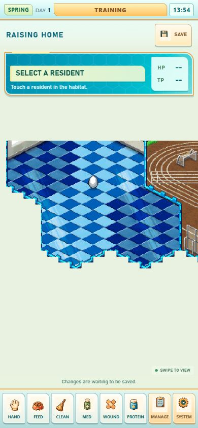
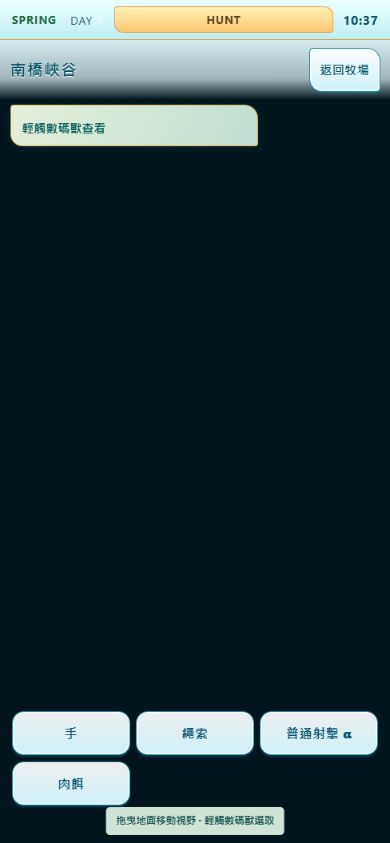

# ROM、指定影片、美術包與目前完成度核對

查核日期：2026-09-08（Asia/Taipei）。

**結論：目前已具備可操作的遊戲骨架、正常 Hunt 捕獲的應用整合、商店／保存／日曆，以及相當完整的戰鬥腳本和素材接線；整款遊戲仍是 PARTIAL。最大的缺口是原作養成與生命週期、玩家個體參賽、長期進展、Hunt 的剩餘條件與視聽驗收。美術來源覆蓋很廣，但來源、正常使用、新外觀完成和可發布是不同狀態。**

本次只新增此資料夾的查核文件、畫面和驗證紀錄，沒有修改玩法、既有美術、存檔格式、測試或正式狀態檔，也沒有 commit、push、merge、deploy。

## 1. 專案與來源

| 項目 | 本次確認 |
| --- | --- |
| 起始工作目錄 | `R:/Projects/Championship2026`，本身不是 Git repo |
| 正式產品及 Git root | `R:/Projects/Championship2026/championship-2026` |
| Branch／HEAD | `main`／`d0c48f340baac61cf399bf5bd5922ce58f3d38c7` |
| 工作樹 | 已有大量未提交成果；結論包含這些工作樹內容，不代表 HEAD 單獨內容 |
| 使用者指定的美術包 | 實際存在於 `R:/Projects/Championship2026/YDIJ_PRIVATE_ROM_ART_PACK`；多層 `YDIJ/_PRIVATE/_ROM/_ART/_PACK` 路徑不存在 |
| ROM | `R:/8ad375ba0bd9b652a25f72dead2b47f78da401e188a8f3e1b7a6f2867ee0c5d1.nds` |
| 本次重新讀取 ROM | 67,108,864 bytes；header `DIGIMONCHAMP`／`YDIJ`；SHA-256 `8ad375ba0bd9b652a25f72dead2b47f78da401e188a8f3e1b7a6f2867ee0c5d1`，與美術包聲明相符 |
| 指定影片 | [BV13u411B7BK：数码宝贝---冠军](https://www.bilibili.com/video/BV13u411B7BK/)，超丸Beletia-Tisha，2022-03-24，13:17 |

本次讀取 AGENTS、README、Owner Direction、Architecture、Current Product Status、Master Sync、雙方狀態開頭、Dependency／Blocker 紀錄及相關 contracts；查詢 Championship Evidence MCP，直接讀 ROM 解碼 help，並重新讀 ARM9 的 Gate 表。原作研究資料位於 `R:/NEXUS LINK/原作` 是既有獨立證據庫，不是 Nexus Link 遊戲產品真值。

影片文字抓取失敗後，瀏覽器成功開啟並播放；本次目視了約 00:55 的線上畫面，重新核對既有 52 筆影格的 SHA-256（52/52 相符），實際重看 V03、V09、V12、V16、V20、V23、V39、V50 共 8 張保存影格。不是重新逐幀看完 13:17，也沒有新做全片音訊轉錄或完整模擬器流程。

影片是英文版畫面，本地 ROM 是日版 YDIJ；版本細節不能直接等同。影片可見異常高的 HP／資金，既有索引亦記錄作者提及金手指；只用於操作、畫面和流程對照，不用它推導正常數值平衡。

證據：[盤點與雜湊](inventory-verification.json)、[本次 Gate 原始表重讀](gate-rom-table-check.json)、[影片完整既有索引](../../../research/video-BV13u411B7BK/VIDEO_OBSERVATIONS.json)、[ROM／影片總索引](../../../research/ORIGINAL_VIDEO_EVIDENCE_INDEX_2026-09-03.md)。

## 2. 原作是怎麼玩的

原作的主要循環是：**安排籠舍與環境 → 照護、訓練並養成個體 → 出獵取得新個體 → 配置自己的隊伍與策略 → 自動戰鬥 → 資金、戰績、稱號與牌照進展 → 更廣的養成與參賽選擇 → 保存並繼續。**

| 系統 | 已確認的內容與玩家操作 | 原作證據 |
| --- | --- | --- |
| 照護 | 手掌選取／搬動／撫摸；食物放地上供角色食用；清掃、藥、傷藥、蛋白質具有不同作用 | 影片 V03 00:30.88；help 137–143；既有投食教學拆解 |
| 環境訓練 | 籠舍是可拼接的不同環境；環境影響能力、種族／屬性及恢復；建議收容數超過後增加壓力，並非一律禁止放入 | V16 02:01.08；help 126、127、131–136 |
| 個體生命週期 | 飢餓、壓力、衛生、疾病、受傷、進化、活動期限、消失與數碼蛋再生 | help 118、122–130、137–142；V39 08:36.94 可見進化結果 |
| Gate／出獵 | 選地區及工具、支付入場費；地區、時間與季節影響遭遇；出獵有期限 | V05／V48–V50；help 96–103；ARM9 Gate 表與 OVL12 扣款追蹤 |
| 捕捉 | Rope 圈繩、束縛、拉扯與斷裂；目標 HP 歸零後進倒地／可收取狀態，再用手掌收進記憶卡 | V08–V10 約 01:01–01:03；help 89、104、105；後續原作捕獲 trace |
| 其他狩獵工具 | Shot 阻止／干擾目標；Wire 在地面阻擋／誘導；誘餌、燈、玩具、炸彈、地雷、捕捉陷阱；插件決定能看見的情報 | V50 12:30.50；help 90–95；後續道具 trace。Wire 與 Rope 分開 |
| 捕獲結果 | 記憶卡、容量、命名／放生、返家提交；卡片中的個體不等於已完成育成名單保存 | V12 01:12.75，New、Name、Rdm Name、Release 與 066G/64G |
| 購物 | 分類、物品詳情、數量、單價／總額、持有資金、确认購買；持有／裝備／使用分開 | V14 01:45、V31、V42–V43；OVL17 交易資料 |
| 戰鬥 | 戰前選模式、賽事、自己的成員與策略；場內由個體自動交戰，顯示狀態、時間、效果與結果 | V20 02:42.84；V23 03:00.39；後續 OVL19 腳本及 CPU 對照 |
| 長期管理 | 賽程、Tamer rank／牌照、戰績、可育成容量及 Cage 空間共同限制進展 | help 144–148；既有 schedule 與 battle 資料 |
| 時間／退出 | 四季、每季八日；End Day、退出 Hunt、Save & Quit 各有不同後果 | help 96–99；V33–V35、V52 |
| 模式與圖鑑 | Free Battle、Title Match、Championship、Password／Wi-Fi 入口；Database 與自己的 Digimon List 分開 | 指定影片既有模式索引；單有入口不能证明完整連線或模式規則 |

上述 help 文字確認的是功能及語意；具體倍率、閾值、時序及例外仍以讀寫流程／原作 trace 為準，不從文字或畫面补出數值。

## 3. 現行功能核對

「已完成」只適用表內列明的範圍；不把模組、catalog、畫面或受控測試存在，當成完整原作驗收。

| 範圍 | 目前已有的實作 | 尚未完成／本次結論 |
| --- | --- | --- |
| 產品骨架 | 單一 app、screen stack、SavePort、共用 Pixi；15 個 screen IDs；DOM UI 和有界 Three 場景 | 基礎已整合。README／Architecture 仍稱部分功能未開始，已落後 |
| New Game／Continue | 可從正常 UI 進入，保存退出後重載再 Continue；本輪重新操作通過 | 原作新遊戲初始蛋選擇仍未知；目前取物種表第一顆蛋。起始金額 0 是 PRODUCT_AUTHORED。原作完整開場／教學／孵化未閉合 |
| 個體身份及保存 | 穩定 instance ID、捕獲個體、命名、集合及防重複提交；一份保存權威 | `raisingInstanceIdentity.baseEntry` 仍 `profile:null`；不是完整可成長的個體資料 |
| 育成互動 | 場景、選取、拖動／換籠、相機和反應接縫存在 | `main.js` toolbar 只接 `onMenuEntry`；FEED／CLEAN／MED／WOUND／PROTEIN 未接正常施用。地面投食→尋食→吃掉→寫值未完成 |
| 訓練與健康 | Cage 訓練通道、文字、建議收容數已還原 | 實際訓練增減、飢餓、壓力、污物、腐敗、傳染、受傷／恢復等正常模擬未完成。R2 原型數值不能算原作養成 |
| 進化與再生 | 有物種／世代和部分基礎數值資料 | 個體成長條件、進化、寿命、死亡／再生、能力繼承、容量及牌照條件的完整閉環未完成 |
| Cage Edit | 36 定義／35 商店籠舍；新遊戲已有原作多格 mask、固定等候室、原生起始組合、放置驗證；Home 有連續拼接呈現 | 不再一概稱「只會單格」。舊 save/draft 沒有原生標記的遷移仍待完成，環境數值效果與實際個體籠舍關係亦未閉合 |
| 時鐘／日程 | 共用日曆、Raising／Hunt 時鐘、End Day、依日期／rank 的賽事讀取 | 有日期不代表每天養成、活動事件、牌照和冠軍賽進展都已實作 |
| Gate | 16 地區、日夜 map binding、地球、名稱／費用／預覽；17 筆 Gate 資料含教學，本輪原始 ROM 重讀全相符 | **費用只顯示，正常入場沒有資金檢查／扣款；全部 Gate 仍 AVAILABLE，rank 解鎖未實作** |
| Hunt 生成與移动 | 正常 native entry、地形讀取、野生生成、共用 RNG／history、移動及動畫接線已大幅完成 | 攜帶自己的個體出獵／放回野外的完整來源與場內更新未閉合；野生之間 AI7 戰鬥未完整驗收 |
| 核心捕捉 | 正常圈線→束縛→拉扯→HP0→落地→手掌→入卡→Result→Home→Save/Continue 已有正常應用 API 整合 | 本輪 focused 正常捕獲測試通過；**完整瀏覽器／實體手機觸控成功捕獲仍未驗收**，本輪瀏覽器只做出獵與空手返家 |
| 全道具 | 46 裝備：12 Rope、12 Shot、6 Wire、8 誘引、8 傷害／捕捉陷阱；30 插件、3 記憶卡；34 消耗品有正式 app 整合測試 | 還缺逐品項原作視聽、次級 Shot 特效與手機驗收。四種散彈 response byte 是 OWNER_APPROVED_ADAPTATION，不能標成完全原樣移植 |
| 捕獲結果 | 可命名、釋放、容量拒絕、返家保存和重複提交防護 | 名稱字元／長度是產品規則；原作完整容量／隨機命名／所有滿額與分支畫面未全部對照；自己的名單操作另有缺口 |
| Shop | 118 表列商品：4 育成物品、49 狩獵項目（46 裝備＋3 卡）、30 插件、35 籠舍；購買、持有、解鎖 predicate 和保存 | rank／徽章的自然取得流程未完成；買到育成用品不代表可以正常使用 |
| Battle 引擎／演出 | 正常 AI、移動、命中、倒地／復起、結果；595 可執行腳本、原作 2D／有界 3D 效果與 54 音效接入本機研究版 | 仍非完整原作戰局：三人 KO slowdown 的 caller context、最後鏡頭、若干狀態、原作 AI profile／RNG 歷史、所有招式正常遭遇及裝置視聽驗收尚未閉合 |
| 玩家組隊／策略 | 畫面與 roster 接縫存在；戰鬥可從 ROM teams 建構 | **正常入口只傳 schedule，預設 `residentIds=[]`、`playerTeamIndex=1`。尚未把自己的養成個體、編隊與策略接到戰鬥** |
| 戰鬥金流 | prepare/start 後扣入場費、實際結果獎勵、防重複扣／加及保存邊界 | 此範圍已有測試；不代表全模式、多回合、稱號／牌照／Championship progression 已完成 |
| 戰鬥模式 | 可顯示模式立方體及目前賽事列表 | mode→賽事映射、完整 Free／Title／Championship、密碼／連線玩法沒有完整正常入口閉環；不能稱全部模式完成 |
| Digimon List | 顯示目前持有者及少量可得欄位 | **NAME EDIT／DELETE／ENTRY 仍 disabled**；13 個原作欄位未接，個體 HP／TP 亦因 profile 缺失無法正常顯示。此處刪除與 Hunt Result 放生不是同一功能 |
| Database／Help／Tamer | 有原作文字、圖鑑列表／資料、Tamer 畫面與可得資金／rank／持有數 | 圖鑑解鎖及排序仍未追完，224圖鑑槽不等於228物種記錄；Tamer 12欄中9欄沒有來源，牌照和戰績未完整接入 |
| 手機與出貨 | 本輪 390×844 有界抽查：Hunt 單一 canvas、無橫向溢出、無 console warn/error，Save & Quit／reload／Continue 通過 | 不構成 Android／iOS 實機、全路由、多尺寸、效能／WebGL loss、完整觸控與發布驗收 |

## 4. 這次新確認的 Gate 問題

**重現：正常 New Game → SYSTEM/Hunt → 場地列表 → 01 南橋峽谷 → 顯示 450 bit／持有 0 bit → 狩獵設定 → 選擇持有工具 → 開始狩獵 → 正常進場。**

來源不是費用資料錯誤：本次直接讀 ROM ARM9 `0x020C9558` 的 17 筆名稱、費用、日夜 field，全部與 catalog 相符，Canyon 的費用確為 450。既有 OVL12 `0x0210F84C` 比較費用、`0x0210F874` 扣款；help101 也說明資金不足不能使用一般收費 Gate。

現行 `championshipStandaloneApp.confirmGate`／`beginHunt` 只處理選場、裝備、生成和進場交易，沒有讀取／扣除費用。`gateCatalog` 又把所有 Gate 設為 AVAILABLE。原作 `player+0xEB8` 有免收費分支，但其設定來源尚未追明；產品不能因未知就將所有 Gate 默認免收費。

建議先補同一入場交易中的「條件與資金檢查 → 成功建立 runtime → 一次扣款」；失敗／取消不得消耗資金或 RNG。免收費情境和 rank gate 要保留各自證據邊界。本次是查核，未直接修改這些規則。

## 5. 美術與內容完成度

原作可見美術以鮮明藍／青色資訊面板、金黃框線、六角／科技紋理、像素角色、分層地形和物件為主。育成場與戰場透過斜向地面形成空間感，Hunt 是可移動視野的大地圖。Gate 球形世界及部分戰鬥效果使用 3D；這不等於全遊戲是 3D。原角色動畫由 Main/Sub 資源、cell／OAM、palette 及 native sequence／tick 構成，不能只憑一張 spritesheet 自訂播放速度。

目前產品已使用明亮象牙白、暖金、藍綠 DOM 介面和像素場地／角色。這是現有 2026 呈現方向；資訊缺失、空按鈕、錯誤條件及未接回饋不能靠相近美術視為完成。

| 美術範圍 | 本次確認 | 未完成的部分 |
| --- | --- | --- |
| 原始美術包 | 6,317 個 raw 檔案實際存在；1,705 families，manifest 內 1,541 ART_RENDERED／164 DIAGNOSTIC_ONLY，49 families 有 warning | 164 diagnostic 不算已完成可用美術；本輪沒有重新解碼每個 family 或核對包內所有檔案 hash |
| 原作角色工作包 | 224 = 216 一般角色＋8 蛋；validator 通過 17,235 Main/Sub cells、11,480 sequences | 這是資源／技術完整度；Hunt／Battle 可按場景使用，Home 的各種養成動作仍缺事件。不是224隻完整養成可玩 |
| 新外觀製作 | 224 逐隻設計說明；12 新身份有畫稿；2 代表姿態通過；0 完整正常預設置換 | 212 尚未畫新方向，10 套已有單姿態仍待補；完整動作、atlas、註冊、正常場景 QA 未完成。14 歷史設定不算新方向已完成 |
| UI 資源工作包 | 96 scenes、1,369 nodes；本輪 validator 通過，另有87 backgrounds／193 sprite witnesses | 96份布局／資源不等於96个可玩功能。动态文字、選中狀態、條件、音效、轉場、互動仍需逐 screen 接回 |
| 地圖 | production manifests：Hunt30、Cage40、Battle11；本輪正常 Home／Hunt 已看到場地 | 30不是30個不同 Gate：16個地區與日夜／教學資源是不同計數。全地圖場景及動畫／遮擋驗收未完成 |
| 3D／VFX | 通用 VFX manifest26 systems；Battle 本機包151 banks／1,231 cells；R13 五種原生 impact family 與54聲音已接入 | 所有26系統不保證在正常場景觸發；Hunt 道具仍有程式畫的暫時圖形，完整視聽與物理手機 QA 待補 |
| Production Index | 24 entries，所有指向 manifest 存在；9項明確 runtimeEligible=true；shippingReady=true 為0 | 24含暫時／review／退役項，不是24個完成品。manifest readiness、實際使用與最終發布分開 |

本次另直接目視包內 M201 原作 Main atlas 與 Training/Home component breakdown，交叉對照影片和目前遊戲。沒有新增／替換美術。

原作影像與聲音在本次僅用於本機研究核對；現有 index／Owner 紀錄包含局部使用狀態，本報告不據此擴大產品授權或 shipping 範圍。

## 6. 驗證結果與文件落差

| 本次執行 | 結果 |
| --- | --- |
| ROM header／SHA-256 | PASS，與美術包相符 |
| Gate 原始 ARM9 表 | 17/17 名稱／費用／日夜 field 與 catalog 相符；沒有重跑 OVL12 caller |
| 影片歸檔完整性 | 52/52 影格 hash 相符；本次目視8張，另有線上播放器取樣 |
| Focused | 21/21 PASS：正常捕獲保存、全消耗品整合、battle經濟app及交易 |
| Full JS regression | **1,281 total；1,279 PASS／2 FAIL／0 skip／0 todo**；76秒 |
| 原作角色 validator | PASS：224／17,235 cells／11,480 sequences |
| UI validator | PASS：96 scenes／1,369 nodes |
| Production validator | **FAIL：仍要求21 entries，目前實際24**。不能因所有manifest存在就宣稱正式validator全過；在第99行停止後，後續assertions不算執行成功 |
| 本次瀏覽器 | 390×844正常Gate/Loadout/Hunt/Return與Save/Quit/reload/Continue；Hunt一個canvas；無橫向溢出／warn/error |
| git diff --check | PASS；只有既有CRLF轉LF提示 |
| Pages | 未重新build；tracked `src/data/championship/catalogs/entities.r1.json` 仍刪除，build依tracked清單取input的缺口仍存在 |

兩個 JS 失敗皆在 `tests/championship-vs2-p1r-presentation-cases.mjs`：第10行案例禁止 `CAPTURE|HUNT_RESULT`，第19行案例禁止 `ATTACK|CAPTURE|ITEM|SCAN|FLEE`；現行 `vs2Screens.js` 的 `CAPTURE_TRAP` 提示會命中。這是已觀察到的測試與最新範圍衝突，不是捕捉失敗的直接證明，也不能隱藏成全綠。本輪未修改測試。

README／Architecture／部分舊 Capture contract 仍保留 VS3 未開始、normalEntryCapturePlayable=false 等歷史描述；最新 Hunt API測試已與之不同。`characters-v1` manifest 的 static-first-frame用語也不足以描述後續Hunt/Battle native動畫接線。應逐一做文件／contract對照更新，不應為了消除文字衝突改回舊功能。

既有 R13 的 595×4受控執行、90個新增原始ARM比較及先前手機瀏覽器影片，不是本次重新執行的原作測試。其記錄可支持「既有工程驗收」，不能冒充本次全部正常招式／實體裝置驗收。本次全套JS測試亦不是完整ROM遊玩比較。

紀錄：[focused.log](focused.log)、[regression.log](regression.log)、[character-validator.log](character-validator.log)、[ui-validator.log](ui-validator.log)、[production-validator.log](production-validator.log)、[browser-receipt.json](browser-receipt.json)、[diff-check.log](diff-check.log)。

## 7. 下一個安全工作順序

1. **先閉合現行 Hunt slice**：修正一般Gate的費用／資金交易與rank條件證據；完成真正手機觸控成功捕獲到Save/Continue；補逐道具視聽及攜帶個體／AI7缺口。沿用已有捕捉與34種消耗品實作。
2. **建立可養成的持久個體**：追原作個體欄位與writer，接地面投食→尋食／食用→健康／能力；再接環境訓練、壓力、病傷、進化、壽命／蛋化。不要拿species base或R2原型值代替成長紀錄。
3. **讓自己的個體參賽**：名單／改名／放生／ENTRY、編隊及策略、資格、battle profile、結果回寫、戰績與獎勵保存；移除正常入口用預設ROM隊伍代替玩家的限制。
4. **補全長期遊戲內容**：Tamer牌照／rank／空間、所有battle模式／賽程／Championship、圖鑑解鎖、日期事件與完整保存。連線／密碼需先釐清原作保留方案與可達流程。
5. **美術隨功能完成驗收**：已有原作包不重複生圖；Home照護、Hunt工具、戰鬥剩餘時序／鏡頭逐事件接入。新外觀依224佇列製作，以整隻完整動作與正常場景通過才置換。
6. **同步收斂測試與文件**：處理兩個舊測試、21/24 validator、過期contracts和Pages input。最後做五種手機尺寸、Android/iOS實機、長時間／背景恢復／WebGL等全流程QA，再另行評估發布。

這個順序是本次查核建議。查核已完成；以上實作、未知trace、完整手機驗收和發布阻塞並未被此報告標成完成。

## 8. 主要程式與後續證據落點

- `src/championship/app/main.js:361`：正常battle只傳schedule；`:633`：toolbar的callback接線。
- `src/championship/app/championshipStandaloneApp.js:1062`：beginHunt；`:1155`起：Result／Home提交。
- `src/championship/gate/gateCatalog.js:105`：費用與AVAILABLE狀態；`scripts/build-gate-catalog.py:18`：原作compare/debit追蹤。
- `src/championship/app/battleRuntime.js:88`：預設player替身隊伍；`:487`：playerPresets構建。
- `src/championship/raising/raisingInstanceIdentity.js:51`：個體profile缺口。
- `src/championship/app/digimonListScreen.js:59`：未接欄位與controls；`tamerInfoScreen.js:70`：12欄source。
- `src/championship/cage/nativeRanchLayout.js`、`cageEditRuntime.js`、`cageEffects.js`：原生多格與訓練數值的分離。
- [Hunt兩階段現況與限制](../../../research/HUNT_CORE_TWO_STAGE_IMPLEMENTATION_2026-09-08.md)。
- [Battle R13現況與限制](../../../art/production/battle-presentation-r13/IMPLEMENTATION_2026-09-08.md)。
- [角色新外觀進度](../../../art/production/characters/appearance-refresh-v1/pixel-v2/STAGE_PROGRESS.md)。

