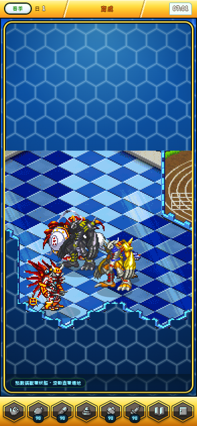
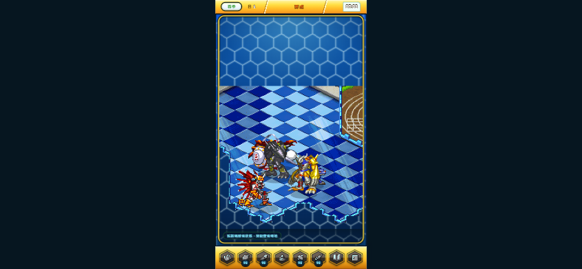
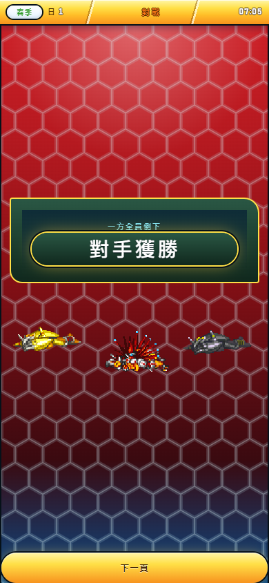

# 最近 repo 與本地遊戲變動收束

日期：2026-09-16。正式 repo：`R:/Projects/Championship2026/championship-2026`。
核對基準：`main@3e212c2e1b80306e51f2b2593484a28442dca4d3`。近期整理範圍為 9 月 14–16 日、`c8cd053` 的整合批次到上述 HEAD。

這是本次驗收回條；持續更新的狀態入口仍是 [Current Product Status](../../CURRENT_PRODUCT_STATUS.md)。本次完成近期變動核對、本地重新建置、瀏覽器驗收、驗收腳本與文件整理，沒有新增或重寫玩法。

## 已整合且已發布的內容

| 批次 | 玩家可見變動 | 本次核對結果 |
|---|---|---|
| `c8cd053` | 自由／密碼／通訊對戰接線、籠子地面對齊與復原星星 | 已存在主分支；完整程式測試通過。這輪不把先前的受限還原改成全原作完成。 |
| `9b5c69a`、`ae0ebed`、`e879c2e` | 原創角色與既有籠子優先；研究與後續現代化規劃併回 main | 屬方向、研究和規劃，不等於已經接入遊戲。 |
| `1a6653e`、`e685e89` | 試玩建置整合及未使用美術清理 | 本次建置為 3,964 個檔案；沒有再刪除資產。 |
| `4010b98`、`6957141` | QA 修正、拼裝 UI 素材在指定試玩站顯示、含空白密碼不被截斷 | 本次帶空白的完整隊伍密碼可進入對戰並到達結果頁。 |
| `2c16d25` | 從自己擁有的 1–3 隻數碼獸產生隊伍密碼 | 三人選擇、第四人限制、改隊伍清空舊碼、22 字密碼與實際對戰通過。 |
| `6d6a8f9`、`c5d5670`、`3e212c2` | 養成首頁以棲地為中心，浮動角色資訊、離頁存檔、長名字與缺頭像時的版面修正 | 6 種直向尺寸通過；新增直橫向與真實離頁後 Continue 檢查通過。 |

當次 `git ls-remote`、本地 HEAD 和 `origin/main` 都指向 `3e212c2`。[GitHub CI](https://github.com/Orochi771127/championship-2026/actions/runs/35050755505) 與 [Pages 部署](https://github.com/Orochi771127/championship-2026/actions/runs/35050755483) 均成功。

[線上試玩](https://orochi771127.github.io/championship-2026/championship.html) 的建置紀錄與本次本地輸出具有相同 commit、檔案數和 build ID：`43fb1cb958e852b1b50953c5ebe7d1c745c0ef5ccdfb8146dbf3f4409142ba40`。所以先前「我的隊伍密碼尚未發布」是舊紀錄，不能繼續當作目前狀態。這是本次唯讀查證已有部署，並非本次重新發布。

## 本次實際落地

- 新增 `npm run test:browser:recent`，把「QA 安裝 → 養成首頁 → 真實離頁保存 → Continue → 自己的隊伍密碼 → 帶空白輸入 → 對戰結果」接成一條可重跑的驗收。使用獨立 Chrome 測試環境，不讀寫玩家平常使用的瀏覽器設定檔。
- 首頁瀏覽器驗收在開局或 Continue 掛載失敗時，現在會保存截圖、畫面文字、錯誤、請求失敗及該次測試存檔；資料留在 `.tmp`，不把原始診斷存檔放進正式報告。
- 更新目前狀態、文件入口與測試說明；保留歷史 Owner 決定、另一位 Agent 的 STATUS/DELTA 及既有 Master Sync。那些檔案的舊日期不被冒充為今日重新簽核。
- 本次改動是驗收工具和文件；遊戲 `src/`、素材、存檔格式、玩法、發布清單與權限未更動。本次未 commit、push 或 deploy。

## 驗證證據

| 檢查 | 實際結果 | 證據 |
|---|---|---|
| 完整程式測試 | 1,555 通過、0 失敗、0 跳過 | [validation.json](validation.json) |
| 啟動模組預載 | 184 個模組一致 | [validation.json](validation.json) |
| 試玩版建置及檢查 | 3,964 檔，兩者成功；與線上 build ID 相同 | [validation.json](validation.json) |
| 首頁既有瀏覽器驗收 | 360×800、390×844、393×852、412×915、430×932、375×812；孵蛋、撫摸、搬動、落地、保存及 Continue；Pixi 載入失敗備援 | [home-browser.json](home-browser.json) |
| 本次新增整合驗收 | 390×844、844×390；真實離頁保存；密碼完整流程 | [recent-integration-browser.json](recent-integration-browser.json) |
| 頁面與資源 | 通過的上述流程沒有 page error／缺檔；首次首頁失敗見下方限制 | 同上 |

重跑方式：在正式 repo 用一個終端執行 `npm run serve`，另一個終端執行 `npm run test:browser` 或 `npm run test:browser:recent`。測試需要已安装的系統 Chrome，輸出預設在 `.tmp/browser-qa`。這一輪回條只對應上述 HEAD 及列出的測試檔案指紋，不自動適用未來變動。

### 本次畫面

## 本地角色概念素材的歸位

開始時唯一未追蹤的工作是 `docs/art/production/characters/appearance-refresh-v1/pixel-v2/gpt-image-2.5-concepts-r1/`：13 檔、6,707,704 bytes，含候選、拒稿歷史、提示與 manifest。本次完整保留，沒有合併進 runtime、改圖或更改核准狀態。

四個候選是 M006、M312、M418、E000。四張個別圖片與總圖的 SHA-256 都與原 manifest 相符；重新讀圖確認總圖為 1254×1254，871,568 完全透明像素、2,811 完全不透明像素、698,137 半透明像素。因此它確實有透明背景，但尚不是只含 alpha 0/255 的正式像素動作圖。

其現行分類仍為 `ART_PROPOSAL_REFERENCE_BACKED`，且 `humanApproved/runtimeEligible/shippingReady/publicReleasePermitted` 都為 false。這條參考圖概念線不能自行算入乾淨原創的商業完成數。完整動作、原生尺寸、色盤、原點、正常遊戲與實機驗收仍未完成。

原創正式工作的下一個交付依 [既有優先計畫](../../planning/ORIGINAL_CHARACTER_CAGE_FIRST_2026-09-15.md) 推進：先讓一隻完整原創角色走完 Main/Sub 動作與圖集，並完成起始四個籠子定義 35／0／1／15，再驗證養成、狩獵、對戰、商店與 Save/Continue。這份收束報告不重新選角、不批准候選、不啟動帳號、後端或新的玩法。

## 保留的限制與下一步

1. **首次首頁 Continue 出現一次 30 秒逾時。** 當時未保存失敗頁面的內容，因此原因未知。補診斷後整套重跑通過，另一次真實離頁 Continue 也通過。保留 `INTERMITTENT_UNREPRODUCED`，不宣稱已修好某個存檔缺陷。下次發生應先讀 `.tmp/browser-qa/vs1/continue-failure.json` 與截圖。
2. **真實裝置尚未驗收。** 以上是 Windows Chrome 的桌面／手機尺寸驗收，不是實體 iPhone、Safari 或 Android 觸控測試。
3. **完整原作符合度、籠子前牆遮擋、全角色全動作與商業素材仍未結案。** 歷史局部 PASS 不覆蓋這些缺口；後續依既有契約逐項完成。
4. **下一次提交要分清本輪工具／文件與原先概念素材。** 本輪準備好可檢閱檔案與驗收回條，沒有擅自把概念圖變成已批准資產，也沒有新增發布授權。

使用的 skills：`engineering:code-review`、`engineering:debug`、`engineering:testing-strategy`、`engineering:documentation`、`championship-art-production`、`game-ui-ux`。工具使用 Serena 查看正式程式符號，Playwright 操作真實介面與截圖，Git／GitHub API 查證版本及既有發布。PixiJS MCP 的 9222 連線不可用，因此未宣稱取得其場景樹診斷；正常畫面、canvas 邊界及既有 renderer 測試另有上述驗證。
