# 正式設定畫面報告（2026-09-29 設定回合）

狀態：主體在 `bfb1f28` 合併到 `main`；2026-10-04 補上驗收後的修正、文件、預載清單與建置輸入登記後發佈到公開試玩版（第 13 節）。英文未經母語審稿，實機未驗證。

依據：[Owner Direction 2026-09-29「Formal settings」](../../coordination/OWNER_DIRECTION.md)。延續同日 UI 重設計的邊界：不改玩法、數值、進化、碰撞、存檔格式，不另建 app、router、存檔或世界狀態，雲端未接通前不做假登入、不把本機保存標成雲端同步。

術語表：[GLOSSARY_ZH_TW.md](GLOSSARY_ZH_TW.md)。

## 1. 入口與操作

- 標題畫面右上的齒輪（`#cm-title-settings`），或遊戲中「系統」選單 →「設定」。開場動畫播放時齒輪隱藏。
- 設定是原生 `<dialog>` 的 modal：開啟時底下的牧場、戰鬥等畫面不能被點到。
- 手機先顯示分類清單，點分類進入細項；寬度 ≥ 768px 時左側固定分類、右側細項。
- 返回：Esc 與瀏覽器／Android 返回鍵都是「細項 → 清單 → 關閉」逐層退回，不會離開遊戲頁面，也不會改變目前畫面。關閉後焦點回到開啟它的按鈕。
- 每個選項即時生效，不需要按「儲存」。

## 2. 設定項目

| 分類 | 設定 | 選項 | 預設 | 保存範圍 | 作用 |
|---|---|---|---|---|---|
| 外觀與顯示 | 主題 | 深色夜景／藍白清爽／經典暖黃／跟隨系統 | 深色夜景 | 帳號偏好 | 全介面配色；標題與開場是主視覺，固定用夜景配色 |
| 外觀與顯示 | 文字大小 | 標準 100%／較大 115%／大 130% | 100% | 此裝置 | 介面字級與行高等比放大；工具列圖示說明不放大，避免擠出畫面 |
| 外觀與顯示 | HUD 密度 | 標準／精簡 | 標準 | 此裝置 | 精簡模式隱藏操作提示與次要說明；數值、按鈕與狀態不變 |
| 畫面品質 | 畫質 | 自動／省電／平衡／高品質 | 自動 | 此裝置 | Pixi 與 Three.js 的解析度上限、反鋸齒、高光碎片數量（第 4 節） |
| 聲音 | 靜音 | 開／關 | 關 | 此裝置 | 所有音效歸零 |
| 聲音 | 主音量 | 0–100，每格 5 | 100 | 此裝置 | 有效音量 = 主音量 × 音效音量 |
| 聲音 | 音效 | 0–100，每格 5 | 100 | 此裝置 | 戰鬥與高光音效 |
| 語言 | 語言 | 繁體中文／English | 繁體中文 | 帳號偏好 | 全玩家流程的文字，切換時就地更新，不重新載入 |
| 操作與輔助 | 減少動態效果 | 跟隨系統／開啟／關閉 | 跟隨系統 | 此裝置 | 開啟時減少移動、縮放與閃光，只保留短暫淡入淡出 |
| 操作與輔助 | 閃光強度 | 標準／柔和 | 標準 | 帳號偏好 | 柔和時全畫面閃光亮度乘以 0.35 |
| 操作與輔助 | 重要演出 | 完整／精簡 | 完整 | 帳號偏好 | 完整約 3.7 秒，精簡約 2.4 秒；結果與獎勵完全相同 |
| 資料與帳號 | —（資訊與重設） | | | | 顯示存檔與設定的保存狀態、帳號狀態；可重設單一分類或全部設定 |

「帳號偏好」表示將來有帳號時要跟著帳號走的設定；目前沒有帳號服務，所以它們同樣只存在這台裝置，畫面上照實標示，不顯示同步成功。

## 3. 外觀與主題

三套配色都是同一組設計 token（`src/championship/app/ui/tokens.css`）的不同取值，由 `<html data-theme>` 切換；各畫面不另寫主題規則。主題在第一次繪製前就由 `championship.html` 開頭的小段程式套用，重新整理不會先閃出預設主題；單元測試會把這段程式和模組的對應規則逐項比對。

每套主題的主要文字與背景對比都至少 4.5:1（`tests/championship-settings-cases.mjs` 的配色對比測試）。

| | 深色夜景 | 藍白清爽 | 經典暖黃 |
|---|---|---|---|
| 牧場 | 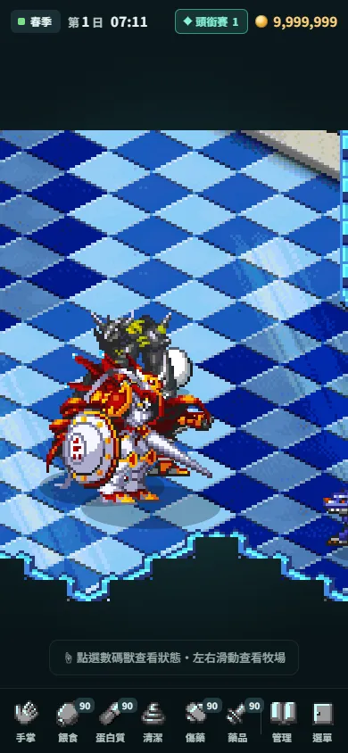 | 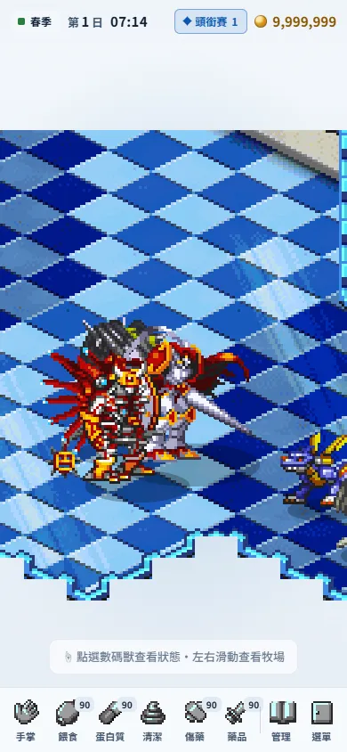 | 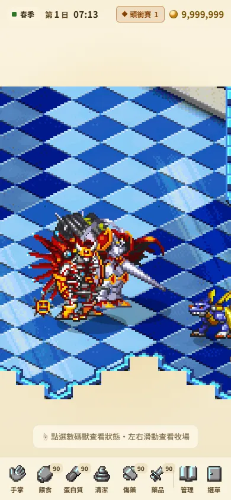 |
| 設定・外觀 | 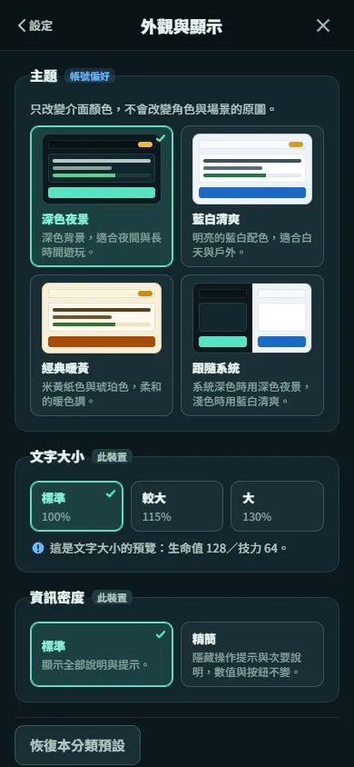 | 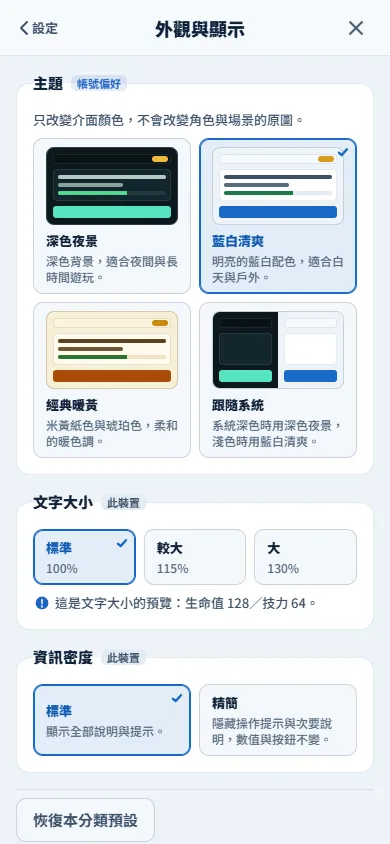 | 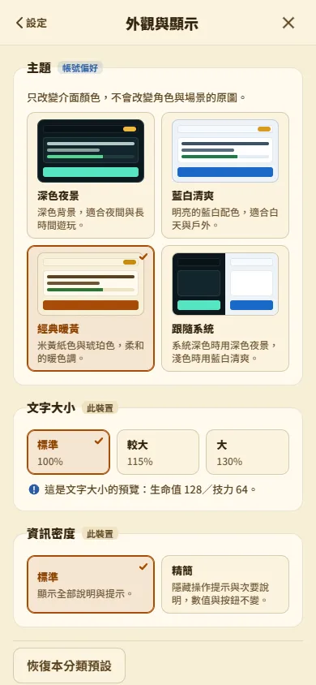 |
| 商店 | 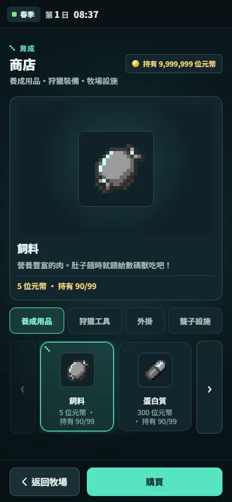 | 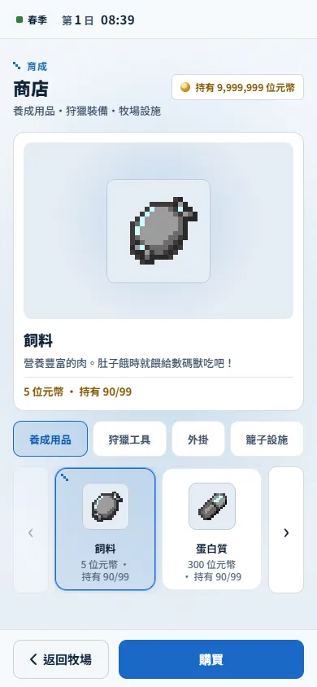 | 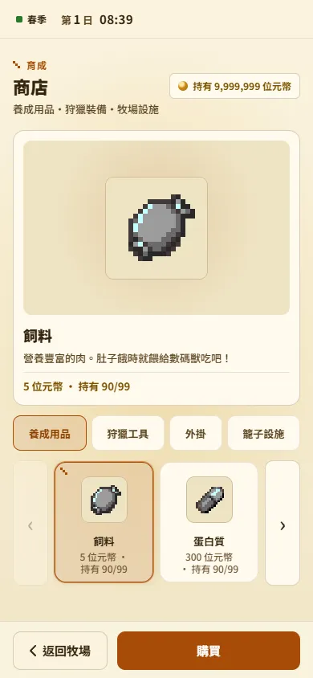 |
| 戰鬥結算 | 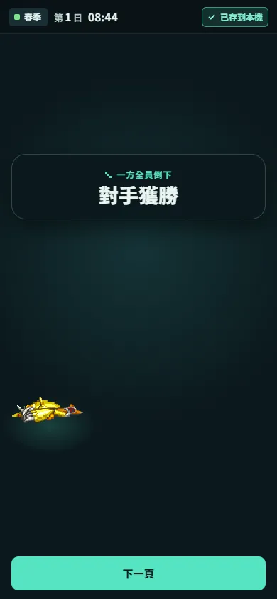 | 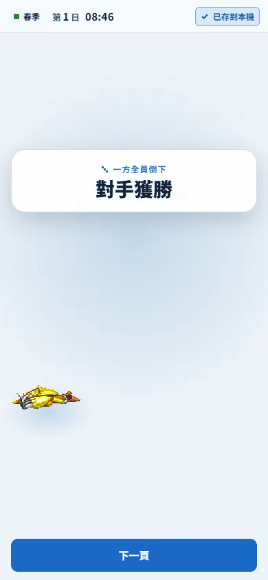 | 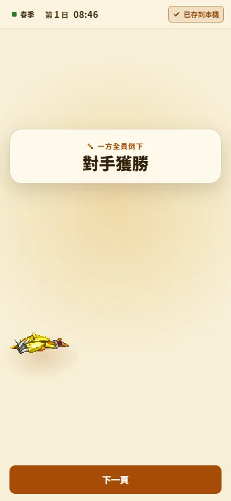 |

## 4. 畫質

| 等級 | Pixi 解析度上限 | Pixi 反鋸齒 | Three.js 像素比上限 | Three.js 反鋸齒 | 高光碎片 | 碎片壽命 | 階梯標記 | 裝飾 | 毛玻璃／光暈 |
|---|---|---|---|---|---|---|---|---|---|
| 省電 | 1 | 關 | 1 | 關 | 40 | 0.7× | 2 | 精簡 | 關 |
| 平衡 | 2 | 開 | 2 | 開 | 96 | 1× | 3 | 完整 | 開 |
| 高品質 | 3 | 開 | 3 | 開 | 160 | 1.25× | 3 | 完整 | 開 |

- 「平衡」就是重設計後的原有畫質。
- 「自動」一開始依裝置條件選擇：省流量模式、記憶體 ≤ 2 GB 或 CPU ≤ 2 核時用省電，其他用平衡。遊玩時以 5 秒為一個區間，區間內影格時間的中位數超過 28 ms 就算一個慢區間，連續兩個慢區間就降到省電，而且只降一次，不會來回切換。超過 250 ms 的單次停頓（載入、切到背景）會讓區間重新計算而不算慢；畫面切換後尚未穩定的時間也不列入判斷。
- 省電不刪除任何必要回饋：結算數字、獎勵、命中與狀態提示都照常顯示。

### 各等級實測

環境：桌面 Windows、無頭 Chrome、WebGL 走 ANGLE／Direct3D 11（NVIDIA RTX 4070 Ti），視窗 390×844、裝置像素比 3（模擬高密度手機螢幕，讓解析度上限有作用）。每個等級用新的瀏覽器環境走同一條正常流程：牧場靜置 6 秒 → 商店買一個蛋白質 → 自由對戰第一場單隻對戰、自動戰鬥 → 結算重要演出。影格時間由頁面載入前就掛上的 requestAnimationFrame 取樣器記錄。

| 等級 | Pixi 畫布倍率 | 牧場 p50／p95 | 對戰選擇 p95 | 戰鬥 p95（最長） | 結算演出 p95 | 高光碎片 | 碎片每幀繪製（平均／最長） |
|---|---|---|---|---|---|---|---|
| 省電 | 1×（390×844） | 16.7／16.8 ms | 16.8 ms | 16.8 ms（150 ms） | 16.8 ms | 40 | 0.19／1.4 ms |
| 平衡 | 2×（780×1688） | 16.7／16.8 ms | 16.8 ms | 16.8 ms（33 ms） | 16.7 ms | 96 | 0.18／1.3 ms |
| 高品質 | 3×（1170×2532） | 16.7／16.8 ms | 16.7 ms | 16.8 ms（33 ms） | 16.8 ms | 160 | 0.18／1.8 ms |

- 三個等級在這台桌機上都穩定 60 fps，量測沒有頁面錯誤。省電那次戰鬥的 150 ms 單幀出現在第一個跑的等級，是冷快取載入素材造成的，之後兩個等級沒有再出現。
- 等級之間真正的差別是像素量：同一個畫面，平衡要畫的像素是省電的 4 倍，高品質是 9 倍。桌機 GPU 吃得下，所以影格時間看不出差異；手機 GPU 的填充率低很多，這正是省電與自動降級要處理的情況，但本輪沒有實機數據。
- 原始資料：[perf-tiers.json](perf/perf-tiers.json)。

## 5. 聲音

目前遊戲裡真正有聲音來源的只有音效（戰鬥音效與重要演出音效），所以只提供靜音、主音量與音效音量。沒有音樂、語音或介面音效的來源，就不放這些滑桿，避免出現調了沒有作用的設定。

所有音效走同一條音訊匯流排（`src/championship/presentation/audioBus.js`）：有效音量 = 主音量 × 音效音量，靜音時為 0；調整時用短淡入淡出，不會爆音。音訊環境建立時就套用已保存的音量，第一聲不會先用預設音量播放。「試聽」不會疊加，靜音時不播放。

## 6. 語言

- 繁體中文與 English 涵蓋標題、新遊戲、開場、牧場、名冊、紀錄、設施、商店、資料庫、賽程、馴獸師、說明、系統選單、傳送門、出發準備、狩獵、捕捉結果、對戰選擇、隊伍、戰鬥、結算與設定本身。
- 切換語言時，常駐介面（工具列、狀態列、目前畫面、設定畫面）就地改字，不重新載入、不重建牧場畫布，遊戲狀態不受影響。
- 以繁中原文為鍵查英文；同字不同義時用語境鍵。日期與數字依語系格式化，英文有單複數。
- 專有名詞依術語表保留繁中：數碼寶貝種名、起始角色自動名、浩司、惠子，以及引號中的隊伍與人名。

靜態覆蓋檢查（`node scripts/check-locale-coverage.mjs`，`bfb1f28`）：

| 項目 | 數量 |
|---|---|
| 介面顯示字串（不重複） | 663，已翻譯 663，缺 0 |
| 介面固定用語（UI_COPY） | 252，缺 0 |
| 商店品名／說明 | 118／118 |
| 說明頁 | 84 |
| 賽事 | 62 |
| 教學台詞／提示 | 72／13 |
| 牧場信件 | 109 |
| 設施／傳送門 | 36／17 |
| 資料表缺口 | 0 |

唯一的插值模板是捕捉繩名稱產生器，12 個展開後的名稱都已逐一翻譯。

執行時走查（英文、130% 文字，390×844 與 360×800，從標題經正常選單走過 49 個畫面狀態並打一場練習賽）：

- 頁面錯誤 0；唯一的主控台錯誤是測試存檔安裝頁的 favicon 404。
- 執行時查不到英文的字串 14 個，全部是含數碼寶貝種名的對戰標題（例如 “Single battle — 太陽獸”），依術語表保留繁中，不是漏翻。前一次走查的 40 個裡，其餘 26 個（傳送門與地圖名、馴獸師資訊欄位）已補上。
- 360px 寬時，商店分頁「Cages」原本被擠出畫面、商品卡下方的價格與持有數被切掉；已修正為分頁換行、文字放大時商店整區捲動（第 7 節）。標題畫面的背景裝飾層超出畫面寬度屬於原設計，不會造成橫向捲動，中文也相同。

| 牧場 | 設定・外觀 | 商店 | 賽程 |
|---|---|---|---|
| 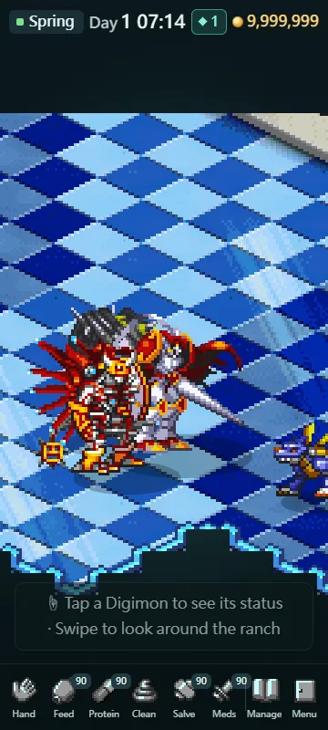 | 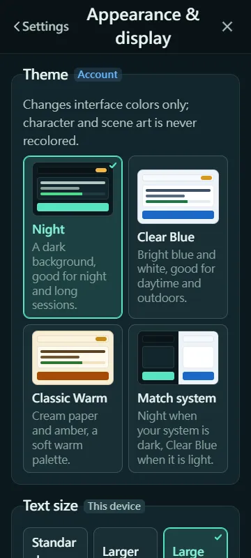 | 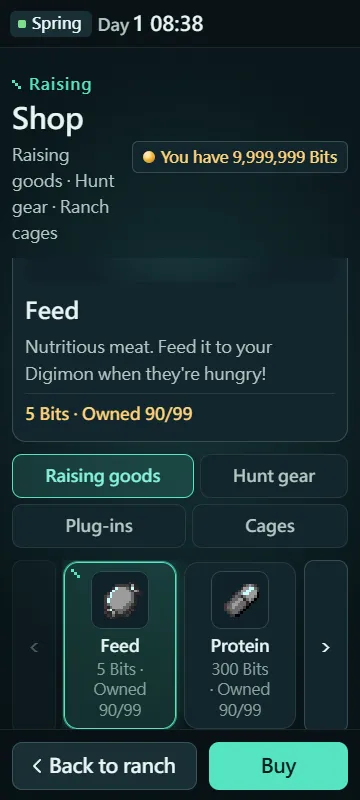 | 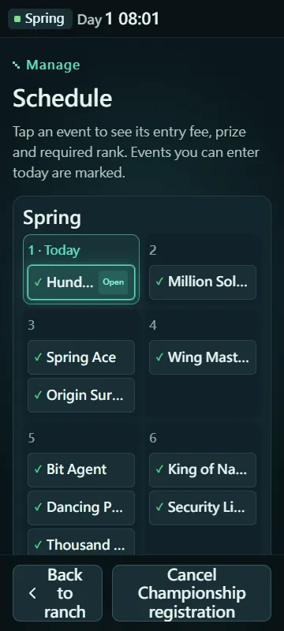 |

## 7. 操作與輔助

- **文字大小**：字級與行高都乘以同一個倍率。130% 時牧場同伴卡的名稱與地點改為換行、量表改為上下排列；狀態列可換行。商店在單欄版面放大文字時改為整區捲動：分頁放不下就換到第二行，商品卡跟著換行後的價格與持有數長高，說明卡保持完整高度，彼此不再互相壓到（2026-10-04 最終走查後修正）。
- **HUD 密度**：精簡模式只隱藏提示類文字（操作提示、次要說明、賽程頁尾、狩獵操作說明等），任何數值、按鈕與狀態都保留。
- **減少動態效果**：跟隨系統時讀取裝置設定；開啟時把各畫面的位移、縮放與閃光改成短暫淡入淡出，重要演出只留結果呈現。
- **閃光強度**：柔和時，戰鬥命中、狩獵與重要演出的全畫面閃光亮度都乘以 0.35。
- **重要演出**：精簡版把五個階段壓縮到約 2.4 秒（完整版約 3.7 秒），最後顯示的數字、獎勵與入帳完全相同。點一下畫面可以略過；略過時聲音立即停止，不再播放收尾音，Three.js 碎片也立刻釋放。

### 重要演出的構圖修正

修正前，碎片會飛過結算文字、遮罩蓋住結算板、爆發點在板子上而不是角色身上，角色也不在光柱下。修正後分成兩層：

- **後層**（在結算板下方）：遮罩、光柱、階梯標記、光環與 Three.js 碎片。所有會動的東西都在文字後面，任何碎片都不會蓋住勝負與金額。
- **前層**（在結算板上方）：只有爆發閃光（結算板落定前就淡出）與「輕觸畫面略過」提示，也負責接收略過的點擊。
- 光柱、光環、爆發點與遮罩的透光中心都對準勝方角色，結算板落在角色上方；舞台光依角色位置計算，畫面上下不再留大片空白。

| 爆發 | 揭曉 | 落定 |
|---|---|---|
| 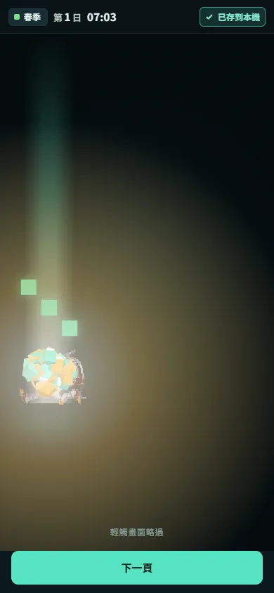 | 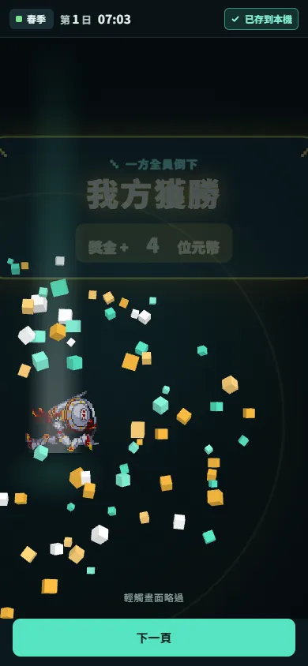 | 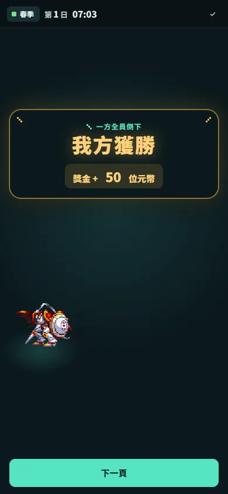 |

| 中文 130%（經典暖黃，360×800） | 精簡 HUD（390×844） |
|---|---|
| 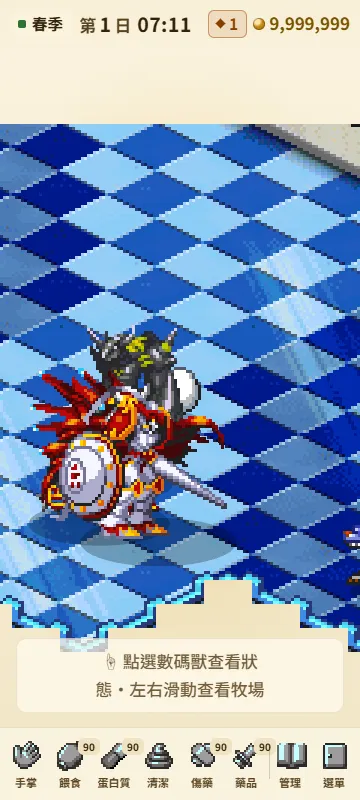 | 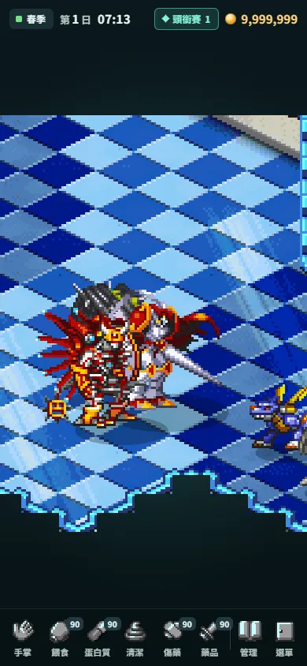 |

## 8. 資料與帳號

- 設定存在獨立的本機鍵 `championshipModernSave:preferences:v1`，和遊戲存檔 `championshipModernSave:v1` 分開；兩者都只經過既有的 `ChampionshipPersistentSavePort.js` 讀寫。
- 文件格式有版本：`{schemaVersion: 1, kind: "CHAMPIONSHIP_PREFERENCES", updatedAt, device: {}, account: {}}`，只保存和預設不同的值。舊版平面格式會自動轉換；遇到比程式新的版本時改為唯讀，不覆寫。
- 變更在 0.3 秒內合併寫入；離開頁面或切到背景時立即寫入。
- 寫入失敗時，選擇仍會在畫面上生效，「資料與帳號」頁照實顯示「設定無法保存」並提供「再試一次」；瀏覽器完全禁止儲存時顯示為無法保存，不假裝成功。
- 「重設」可針對單一分類或全部設定，重設全部會先確認。重設只動設定，不碰存檔、進度、錢包或名冊。
- 帳號：本輪沒有帳號服務，這頁只顯示事實（未登入、存檔在本機），沒有登入按鈕，也沒有任何雲端同步狀態。

## 9. 與自動存檔互不干擾

- 兩個鍵分開寫入，彼此不覆寫：單元測試「settings writes and game saves never overwrite each other」交錯寫入設定與存檔，確認兩邊內容都完整。
- 瀏覽器閘門：在標題畫面改主題、文字大小與語言後，遊戲存檔逐字相同；在遊戲中「重設全部設定」後，進度版本不倒退、錢包不變。
- 設定變更不會觸發遊戲自動存檔，自動存檔也不會寫入設定。

## 10. 測試與驗證

所有瀏覽器檢查都用隔離的測試來源（127.0.0.1:8761／8763）與測試存檔，從不使用 Owner 的 8732 存檔；測試存檔由專案自己的安裝頁準備合法進度，設定則透過設定畫面本身操作（儲存失敗那一項除外，該項刻意讓寫入失敗）。

| 檢查 | 範圍 | 結果 |
|---|---|---|
| `tests/championship-settings-cases.mjs` | 設定定義與驗證、版本轉換、合併寫入、失敗與重試、較新版本唯讀、重設、設定與存檔互不覆寫、套用到頁面屬性、首次繪製前腳本與模組一致、自動畫質、音訊匯流排、重要演出兩層構圖與略過、精簡時序、結算錨點、配色對比 | 26／26 通過 |
| `tests/championship-locale-cases.mjs` | 語系切換、模板、單複數、語境鍵、缺譯退回與記錄、專有名詞例外 | 9／9 通過 |
| `npm run test:ci`（`bfb1f28` 的乾淨匯出，模擬 CI 的 Node 22） | 全部可攜測試 | 1,399／1,399 通過 |
| GitHub CI（Node 22，`bfb1f28`） | 同上 | 通過 |
| `tests/championship-settings-browser.cjs` | 標題開啟設定、主題／文字／語言即時套用與保存、重新整理前就套用、Esc 逐層退回、遊戲中從系統選單開啟、modal、返回鍵逐層退回且不離開遊戲、語言就地切換（同一個牧場畫布）、重設不影響存檔、儲存失敗與重試 | 通過 |
| 畫面走查（三套主題、文字 100／115／130%、中英文、精簡 HUD；360、390、820、1440 寬） | 每個組合從標題走過約 49 個畫面狀態 | 頁面錯誤 0 |
| 商店版面檢查（英文 100／115／130%、中文 100／130%） | 分頁全在畫面內、商品卡文字不被切掉、說明卡不壓到分頁 | 5／5 通過 |
| 各畫質等級效能（第 4 節） | 牧場、對戰選擇、戰鬥、結算演出 | 三個等級 p95 16.7–16.8 ms |
| WCAG 2.2 AA 檢測（`accessibility` skill 的檢查清單；三套主題 × 手機與平板，加 360px 的 130% 中英文） | 觸控目標 ≥ 24px、每個控制項都有名稱、文字對比、Tab 焦點外框、焦點不離開對話框 | 修正後全部通過 |
| 設定畫面的 game-ui-ux 檢查（`game-ui-ux` skill） | 安全區、開啟時的初始焦點、畫面堆疊與返回、事件驅動更新、字串外部化 | 符合 |

### 獨立驗收（另一個 Claude session，2026-10-04）

驗收在自己的工作樹以 `bfb1f28` 原樣執行（測試來源 127.0.0.1:8762，伺服器送出的檔案與提交逐檔比對雜湊一致），只用正常流程：

| 項目 | 結果 |
|---|---|
| 開啟 | 通過：標題與遊戲內都開成 modal；手機先顯示清單，平板清單與內容並列 |
| 返回鍵 | 通過：手機逐層退回、不離開遊戲頁、畫面與牧場畫布不變 |
| Esc | 通過：逐層退回，焦點回到開啟它的按鈕；確認框疊在上面時也不會誤關 |
| 持久化 | 通過：四種主題、三種文字大小、語言、畫質、音量都即時套用；重新載入時在第一張樣式表解析前就已套用；只存非預設值 |
| 儲存失敗重試 | 通過：寫入被拒時照樣套用並顯示失敗，按「再試一次」後保存成功、重新載入仍有效 |
| 恢復設定不影響存檔 | 通過：各分類與全部重設只動設定，遊戲存檔前後三次快照逐位元組相同 |
| 語言即時切換 | 只差一個子項：商店的四個讀屏標籤在英文時仍是中文（已修正，見下） |

驗收另外找到的缺陷，已在提交前修正並驗證：

- **音量滑桿拖不動**：拖曳時每次數值變化都重建整頁，手指下的滑桿被換掉，只吃到第一格。改為音量變化時就地更新數值與說明，環境（系統主題、減少動態）真的改變時才重建。瀏覽器閘門新增拖曳檢查：從 100 拖到 15，滑桿元素不變，保存值相同。
- **窄螢幕英文大字的畫質參數表**：左欄被壓到一字一行。改為標籤欄至少保留 40% 寬度，文字大小卡改用換行排列，不再把 “Standard” 斷成兩行。
- **商店讀屏標籤**：四個 aria-label 改經由翻譯層並登記為可重新翻譯，語言切換時跟著更新。瀏覽器閘門新增英文標籤檢查。
- **重設後鍵盤焦點掉到頁面本身**：重建後把焦點放回同一個重設按鈕。
- **測試安全**：設定閘門原本在沒有指定測試來源時會預設使用 8732（玩家自己的存檔）。現在未指定就拒絕執行，指定 8732 也會拒絕。

還留著的小問題：360px、英文、130% 時，賽程名稱與名冊的長種名以省略號截斷，賽程頁底部按鈕會換成三行。內容都還在、可以操作，只是擁擠。

## 11. 變更清單

新增：

- `src/championship/app/settings/`：`preferenceSchema.js`（設定定義、驗證、版本轉換）、`preferenceStore.js`（合併寫入、失敗重試、狀態）、`preferenceEnvironment.js`（套用到 `<html>` 屬性與系統偏好）、`qualityController.js`（自動畫質）、`settingsPanel.js`（設定畫面）。
- `src/championship/app/ui/settings.css`（設定畫面與精簡 HUD 規則）。
- `src/championship/presentation/presentationPreferences.js`（畫質等級參數與各畫面讀取的偏好）、`src/championship/presentation/audioBus.js`（音訊匯流排）。
- `src/championship/text/locale.js`、`uiText.en.js`、`gameText.en.js`、`catalogs.en.js`、`raisingMessages.en.js`、`tutorialMessages.en.js`。
- `scripts/check-locale-coverage.mjs`。
- 測試：`tests/championship-settings-cases.mjs`（26 項）、`tests/championship-locale-cases.mjs`（9 項）、`tests/championship-settings-browser.cjs`（瀏覽器閘門）。

修改：

- `src/championship/app/ChampionshipPersistentSavePort.js`：設定專用的讀寫埠。
- `src/championship/app/ui/tokens.css`、`ui/highlight.css`、`styles.css`、`intRh2Styles.css`、`vs2Styles.css`、`vs5Styles.css`、`opening.css`：三套配色、文字倍率、省電與減少動態規則；顏色寫死的地方改用 token。
- `championship.html`：首次繪製前套用設定、樣式表版本、標題齒輪。
- `src/championship/app/main.js`：啟動設定、畫質接到 Pixi、音效接到匯流排、重要演出讀取偏好、就地改字。
- `championshipToolbar.js`、`championshipStatusBar.js`、`raisingHomeP1RView.js` 與各畫面模組：系統選單的「設定」入口、模板化文字與就地改字。
- `src/championship/text/uiText.js`、`zhHant.js`、`raisingMessages.zhHant.js`、`tutorialMessages.zhHant.js`：依語系取字。
- 重要演出：`createHighlightSequence.js`（兩層構圖）、`highlightTimeline.js`（精簡時序）、`highlightAudio.js`（略過即靜音）、`createHighlightBurstThree.js`（碎片壽命與反鋸齒）、`battleResultCharacters.js`（角色錨點與舞台光）。
- Pixi／Three.js 畫面（牧場、戰鬥、戰鬥選擇、傳送門、狩獵、戰鬥特效）：讀取畫質、減少動態與閃光強度。
- `tests/ci-test-scope.v1.json`：把兩個新的單元測試納入 CI。

2026-10-04 收尾：

- `src/championship/app/vs2Styles.css`：商店分頁改為換行；單欄版面放大文字時商店整區捲動、商品卡隨內容長高。
- `src/championship/app/ui/settings.css`：選中卡片與目前分類的說明字改用第二層文字色（對比 ≥ 4.5:1）；窄螢幕參數表與文字大小卡的排列。
- `src/championship/app/settings/settingsPanel.js`：滑桿拖曳時就地更新、重設後焦點留在按鈕上。
- `src/championship/app/vs4Screens.js`：商店讀屏標籤經由翻譯層。
- `championship.html`：重新產生的啟動預載清單（191 → 204 個模組），兩張樣式表的版本號。
- `docs/contracts/championship/WEB_BUILD_INPUTS.v1.json`：登記新檔並更新雜湊（第 13 節）。
- 測試：設定閘門新增商店英文標籤與滑桿拖曳檢查，並拒絕未指定或指向 8732 的測試來源；單元測試新增選中狀態的對比檢查。

## 12. 未驗證範圍

- 實機：只在桌面 Chrome 與瀏覽器模擬的手機與平板尺寸上驗證，沒有在真實手機、平板上測試。
- 螢幕閱讀器：有 modal、標籤與即時區域，但沒有用 VoiceOver／TalkBack 實測。
- 英文：PRODUCT_AUTHORED 譯文，未經英文母語編輯審稿。
- 數碼寶貝種名的英文、世代名稱採用哪一套英文慣例，需要 Owner 決定（見術語表）。
- 效能：第 4 節是桌面無頭 Chrome 的相對比較，不代表手機上的實際影格時間；「自動」降級的門檻也還沒在實機上校正。
- 沒有音樂、語音、介面音效、畫面震動與 FPS 上限設定，因為遊戲沒有對應的來源或機制，不做無作用的選項。
- 實際聲音輸出：無頭瀏覽器沒有聲音，只驗證了音量數值與音訊節點的增益。
- 真實的儲存空間不足、無痕模式與兩個分頁之間的同步：用模擬方式驗證（攔截寫入、storage 事件），沒有在真實情境重現。

## 13. 發佈前的建置輸入檢查

`main` 推送後的 Pages 建置在輸入檢查停下（`WEB_INPUTS_NOT_CLOSED`），所以正式站沒有任何變動。原因是 `docs/contracts/championship/WEB_BUILD_INPUTS.v1.json` 還沒列入本輪與 UI 重設計新增的模組與樣式表，已列入的檔案雜湊也已改變。

發佈需要在清單的 `files` 與公開試玩核准清單 `publicPlaytest.files` 加入 22 個新檔，並更新已列入檔案的核准雜湊：

- 設定：`app/settings/preferenceSchema.js`、`preferenceStore.js`、`preferenceEnvironment.js`、`qualityController.js`、`settingsPanel.js`
- 呈現：`presentation/presentationPreferences.js`、`presentation/audioBus.js`
- 文字：`text/locale.js`、`uiText.en.js`、`gameText.en.js`、`catalogs.en.js`、`raisingMessages.en.js`、`tutorialMessages.en.js`
- 樣式：`app/ui/tokens.css`、`app/ui/highlight.css`、`app/ui/settings.css`
- UI 重設計：`app/assetPrefetch.js`、`app/loadWatchdog.js`、`app/autosaveScheduler.js`、`presentation/highlight/highlightTimeline.js`、`createHighlightSequence.js`、`highlightAudio.js`

（路徑皆在 `src/championship/` 之下。）

2026-10-04 依 Owner 指示「全部完成後自檢沒問題就COMMIT跟PUSH且整合到MAIN發布」登記上述檔案並更新已列入檔案的雜湊，`build:playtest` 與 `validate:playtest` 通過、建置產物上的瀏覽器閘門通過後才推送。發佈結果（線上 build ID 與檔案雜湊核對）記錄在[產品現況](../../CURRENT_PRODUCT_STATUS.md)。
